# Database Schema

> FinanceTracker -- Full Database Schema Documentation

## Overview

FinanceTracker uses **SQLAlchemy 2.0** in async mode with **Alembic** for migrations. The schema is database-agnostic:

- **Development**: SQLite via `aiosqlite`
- **Production**: PostgreSQL via `asyncpg`

The database currently has **21 tables**. All tables use integer autoincrement primary keys and include a `created_at` timestamp (most also have `updated_at`).

---

## Entity Relationship Diagram

```
  users
  +---+                               portfolios
  | 1 |------------------------------<| * |
  +---+          |                     +---+
    |            |                       |
    |            |                       |
    | 1          | 1                     | 1
    |            |                       |
    v *          v *                     v *
  user_       alerts                  holdings
  preferences +---+                   +---+
  +---+         |                       |
                |                       |
                |                       | 1
                |                       |
                |                       v *
                |                     transactions
                |                     +---+
                |                       |
    | 1         |                       | 1
    |           |                       |
    v *         |                       v 0..1
  app_          |                     tax_records
  settings      |                     +---+
                |
  +---+         |
  watchlist_    |                     dividends
  items         |                     +---+ (belongs to holding)
  +---+         |
  (belongs      |                     mutual_funds
   to user)     |                     +---+ (belongs to portfolio)
                |
  goals         |                     broker_connections
  +---+         |                     +---+ (belongs to user)
  (belongs      |
   to user,     |                     forex_rates
   links to     |                     +---+ (standalone)
   portfolio)   |
                |                     price_history
  chat_         |                     +---+ (by symbol)
  sessions      |
  +---+         |                     notification_logs
  (belongs      |                     +---+ (belongs to user)
   to user)     |
```

### Mermaid ER Diagram

The same schema as an entity-relationship diagram, showing key columns and foreign keys (not every column). `PK` = primary key, `FK` = foreign key, `UK` = unique. Cascade behaviour: relationships from `users` and the `portfolio -> holding -> transaction` spine are `ON DELETE CASCADE`; the nullable links (`alerts.holding_id`, `alerts.watchlist_item_id`, `goals.linked_portfolio_id`, `tax_records.transaction_id`, `notification_logs.related_alert_id`) are `ON DELETE SET NULL`.

```mermaid
erDiagram
    users ||--o{ portfolios : owns
    users ||--|| user_preferences : has
    users ||--o{ app_settings : has
    users ||--o{ watchlist_items : watches
    users ||--o{ goals : sets
    users ||--o{ alerts : configures
    users ||--o{ broker_connections : links
    users ||--o{ chat_sessions : has
    users ||--o{ assets : owns
    users ||--o{ tax_records : has
    users ||--o{ notification_logs : receives
    users ||--o{ password_resets : requests

    portfolios ||--o{ holdings : contains
    portfolios ||--o{ mutual_funds : contains
    portfolios ||--o{ fno_positions : contains
    portfolios |o--o{ goals : "linked (optional)"

    holdings ||--o{ transactions : records
    holdings ||--o{ dividends : pays
    holdings |o--o{ alerts : triggers
    holdings ||--o{ corporate_actions : "affected by"

    watchlist_items |o--o{ alerts : triggers
    transactions |o--o| tax_records : generates
    alerts |o--o{ notification_logs : sources

    users {
        int id PK
        string email UK
        string password_hash
        string totp_secret "nullable (2FA)"
        json totp_backup_codes "nullable (hashed 2FA recovery codes)"
        string phone "nullable"
        string telegram_chat_id "nullable"
        string preferred_currency
        bool is_active
    }
    portfolios {
        int id PK
        int user_id FK
        string name
        string currency
        bool is_default
    }
    holdings {
        int id PK
        int portfolio_id FK
        string stock_symbol
        string exchange
        string currency
        string fund_type "nullable (DE Teilfreistellung)"
        decimal cumulative_quantity
        decimal average_price
        decimal current_price
        string action_needed "N / Y_* zone"
    }
    transactions {
        int id PK
        int holding_id FK
        string transaction_type "BUY / SELL"
        date date
        decimal quantity
        decimal price
    }
    dividends {
        int id PK
        int holding_id FK
        date ex_date
        decimal total_amount
        bool is_reinvested "DRIP"
    }
    corporate_actions {
        int id PK
        int holding_id FK
        string action_type "SPLIT / BONUS / ..."
        date ex_date
        float ratio
        string status "DETECTED / APPLIED / DISMISSED"
    }
    alerts {
        int id PK
        int user_id FK
        int holding_id FK "nullable"
        int watchlist_item_id FK "nullable"
        string alert_type "PRICE_RANGE / RSI / CUSTOM"
        json condition
        json channels
    }
    watchlist_items {
        int id PK
        int user_id FK
        string stock_symbol
        string exchange
        string action_needed
    }
    mutual_funds {
        int id PK
        int portfolio_id FK
        string scheme_code
        string fund_type "nullable"
        decimal units
        decimal nav
    }
    fno_positions {
        int id PK
        int portfolio_id FK
        string symbol
        string instrument_type "FUT / CE / PE"
        date expiry_date
        string side
        string status "OPEN / CLOSED / EXPIRED"
    }
    goals {
        int id PK
        int user_id FK
        int linked_portfolio_id FK "nullable"
        string name
        decimal target_amount
        string category
    }
    assets {
        int id PK
        int user_id FK
        string asset_type "CRYPTO / GOLD / FD / BOND / REAL_ESTATE"
        string symbol "nullable"
        decimal current_value
    }
    tax_records {
        int id PK
        int user_id FK
        int transaction_id FK "nullable"
        string financial_year
        string tax_jurisdiction "IN / DE"
        string gain_type "STCG / LTCG / ABGELTUNGSSTEUER / VORAB"
    }
    broker_connections {
        int id PK
        int user_id FK
        string broker_name
        string encrypted_api_key "Fernet"
        bool is_active
    }
    chat_sessions {
        int id PK
        int user_id FK
        json messages
        json context
    }
    notification_logs {
        int id PK
        int user_id FK
        int related_alert_id FK "nullable"
        string channel
        string status "QUEUED / SENT / FAILED"
    }
    password_resets {
        int id PK
        int user_id FK
        string token_hash "SHA-256, indexed"
        timestamp expires_at
        timestamp used_at "nullable (single-use)"
    }
    user_preferences {
        int id PK
        int user_id FK "unique (1:1)"
        json column_order
        json custom_columns
        json tax_settings
    }
    app_settings {
        int id PK
        int user_id FK
        string key
        string value "encrypted if sensitive"
        string category
    }
    price_history {
        int id PK
        string stock_symbol "standalone (by symbol)"
        string exchange
        date date
        decimal close
        float rsi_14 "nullable"
    }
    forex_rates {
        int id PK
        string from_currency "standalone"
        string to_currency
        decimal rate
        date date
    }
```



> `price_history` and `forex_rates` carry no foreign keys — they are keyed by symbol/currency-pair and date and are shared across all users.

---

## Core Tables

### users

The central user account table.

| Column | Type | Constraints | Description |
|---|---|---|---|
| `id` | INTEGER | PK, autoincrement | Unique user identifier |
| `email` | VARCHAR(255) | UNIQUE, NOT NULL, INDEX | Login email address |
| `password_hash` | VARCHAR(255) | NOT NULL | bcrypt-hashed password |
| `totp_secret` | VARCHAR(255) | NULLABLE | TOTP 2FA secret (stored in plaintext) |
| `totp_backup_codes` | JSON | NULLABLE | List of SHA-256 hashed one-time 2FA backup (recovery) codes; each is consumed on use. Null when 2FA is disabled |
| `phone` | VARCHAR(32) | NULLABLE | E.164 phone (e.g. +919876543210) for WhatsApp/SMS notification channels |
| `telegram_chat_id` | VARCHAR(64) | NULLABLE | Per-user Telegram chat id (alerts go to each user, not one global chat) |
| `display_name` | VARCHAR(255) | NOT NULL, DEFAULT '' | Name shown in UI |
| `preferred_currency` | VARCHAR(10) | NOT NULL, DEFAULT 'INR' | INR, EUR, or USD |
| `theme_preference` | VARCHAR(20) | NOT NULL, DEFAULT 'dark' | dark, light, system |
| `notification_preferences` | JSON | NOT NULL, DEFAULT '{}' | Channel preferences as JSON |
| `is_active` | BOOLEAN | NOT NULL, DEFAULT true | Soft delete flag |
| `created_at` | TIMESTAMP | NOT NULL, DEFAULT now() | Account creation time |
| `updated_at` | TIMESTAMP | NULLABLE, auto-update | Last modification time |

**Indexes:**
- `ix_users_email` (UNIQUE) on `email`

---

### portfolios

Groups holdings into named portfolios. Each user can have multiple portfolios (e.g., "Indian Stocks", "German ETFs").

| Column | Type | Constraints | Description |
|---|---|---|---|
| `id` | INTEGER | PK, autoincrement | Unique portfolio identifier |
| `user_id` | INTEGER | FK -> users.id, NOT NULL, INDEX | Owner |
| `name` | VARCHAR(255) | NOT NULL | Portfolio display name |
| `description` | TEXT | NULLABLE | User-provided description |
| `currency` | VARCHAR(10) | NOT NULL, DEFAULT 'INR' | Portfolio base currency |
| `is_default` | BOOLEAN | NOT NULL, DEFAULT false | Only one default per user |
| `created_at` | TIMESTAMP | NOT NULL, DEFAULT now() | Creation time |
| `updated_at` | TIMESTAMP | NULLABLE, auto-update | Last modification time |

**Indexes:**
- `ix_portfolios_user_id` on `user_id`

**Constraints:**
- FK `user_id` REFERENCES `users(id)` ON DELETE CASCADE

---

### holdings

The central table representing a stock position within a portfolio. Contains all range levels for the color-coded alert system.

| Column | Type | Constraints | Description |
|---|---|---|---|
| `id` | INTEGER | PK, autoincrement | Unique holding identifier |
| `portfolio_id` | INTEGER | FK -> portfolios.id, NOT NULL, INDEX | Parent portfolio |
| `stock_symbol` | VARCHAR(50) | NOT NULL, INDEX | Stock symbol (e.g., RELIANCE, SAP) |
| `stock_name` | VARCHAR(255) | NOT NULL | Full company name |
| `exchange` | VARCHAR(20) | NOT NULL | NSE, BSE, XETRA, FRA, etc. |
| `currency` | VARCHAR(10) | NOT NULL, DEFAULT 'INR' | Holding currency |
| `fund_type` | VARCHAR(30) | NULLABLE | Fund/instrument class for German Teilfreistellung (null/STOCK, EQUITY_ETF, MIXED_ETF, BOND_ETF, REAL_ESTATE_ETF) |
| `cumulative_quantity` | DECIMAL(18,6) | NOT NULL | Net shares held (auto-calculated from transactions) |
| `average_price` | DECIMAL(18,4) | NOT NULL | Weighted average purchase price |
| `current_price` | DECIMAL(18,4) | NULLABLE | Latest market price |
| `current_rsi` | FLOAT | NULLABLE | Latest RSI-14 value (0-100) |
| `lower_mid_range_1` | DECIMAL(18,4) | NULLABLE | Upper bound of lower caution zone |
| `lower_mid_range_2` | DECIMAL(18,4) | NULLABLE | Lower bound of lower caution zone |
| `upper_mid_range_1` | DECIMAL(18,4) | NULLABLE | Lower bound of upper opportunity zone |
| `upper_mid_range_2` | DECIMAL(18,4) | NULLABLE | Upper bound of upper opportunity zone |
| `base_level` | DECIMAL(18,4) | NULLABLE | Critical support / floor price |
| `top_level` | DECIMAL(18,4) | NULLABLE | Target price / ceiling |
| `action_needed` | VARCHAR(30) | NOT NULL, DEFAULT 'N' | N, Y_LOWER_MID, Y_UPPER_MID, Y_DARK_RED, Y_DARK_GREEN |
| `sector` | VARCHAR(100) | NULLABLE | Industry sector classification |
| `notes` | TEXT | NULLABLE | User notes on this holding |
| `custom_fields` | JSON | NOT NULL, DEFAULT '{}' | User-defined custom column values |
| `last_price_update` | TIMESTAMP | NULLABLE | When price was last refreshed |
| `created_at` | TIMESTAMP | NOT NULL, DEFAULT now() | When holding was first added |
| `updated_at` | TIMESTAMP | NULLABLE, auto-update | Last modification time |

**Indexes:**
- `ix_holdings_portfolio_id` on `portfolio_id`
- `ix_holdings_stock_symbol` on `stock_symbol`

**Constraints:**
- FK `portfolio_id` REFERENCES `portfolios(id)` ON DELETE CASCADE
- UNIQUE(`portfolio_id`, `stock_symbol`, `exchange`) -- One holding per stock per exchange per portfolio

**Action Needed Values:**

| Value | Color | Meaning |
|---|---|---|
| `N` | None | Price outside all alert ranges |
| `Y_LOWER_MID` | Light Red | Price between lower_mid_range_2 and lower_mid_range_1 |
| `Y_UPPER_MID` | Light Green | Price between upper_mid_range_1 and upper_mid_range_2 |
| `Y_DARK_RED` | Dark Red | Price at or below base_level (or between base and lower_mid_range_2) |
| `Y_DARK_GREEN` | Dark Green | Price at or above top_level (or between upper_mid_range_2 and top) |

---

### transactions

Records individual buy/sell actions for holdings.

| Column | Type | Constraints | Description |
|---|---|---|---|
| `id` | INTEGER | PK, autoincrement | Unique transaction identifier |
| `holding_id` | INTEGER | FK -> holdings.id, NOT NULL, INDEX | Parent holding |
| `transaction_type` | VARCHAR(10) | NOT NULL | BUY or SELL |
| `date` | DATE | NOT NULL | Transaction date |
| `quantity` | DECIMAL(18,6) | NOT NULL | Number of shares |
| `price` | DECIMAL(18,4) | NOT NULL | Price per share |
| `brokerage` | DECIMAL(18,4) | NOT NULL, DEFAULT 0 | Brokerage/commission fees |
| `notes` | TEXT | NULLABLE | Transaction notes |
| `source` | VARCHAR(20) | NOT NULL, DEFAULT 'MANUAL' | MANUAL, EXCEL, or BROKER |
| `created_at` | TIMESTAMP | NOT NULL, DEFAULT now() | Record creation time |

**Indexes:**
- `ix_transactions_holding_id` on `holding_id`

**Constraints:**
- FK `holding_id` REFERENCES `holdings(id)` ON DELETE CASCADE

BUY/SELL and positive quantity/price are enforced at the application (Pydantic) level, not by database CHECK constraints.

**Trigger Logic** (application-level):
After any INSERT or DELETE on transactions, the parent holding's `cumulative_quantity` and `average_price` are recalculated:
- `cumulative_quantity = SUM(BUY quantities) - SUM(SELL quantities)`
- `average_price = weighted average of BUY transactions for remaining shares (FIFO)`

---

### price_history

Stores historical OHLCV data for charting and technical analysis.

| Column | Type | Constraints | Description |
|---|---|---|---|
| `id` | INTEGER | PK, autoincrement | Unique record identifier |
| `stock_symbol` | VARCHAR(50) | NOT NULL, INDEX | Stock symbol |
| `exchange` | VARCHAR(20) | NOT NULL | Exchange code |
| `date` | DATE | NOT NULL, INDEX | Trading date |
| `open` | DECIMAL(18,4) | NOT NULL | Opening price |
| `high` | DECIMAL(18,4) | NOT NULL | Day's high |
| `low` | DECIMAL(18,4) | NOT NULL | Day's low |
| `close` | DECIMAL(18,4) | NOT NULL | Closing price |
| `volume` | BIGINT | NOT NULL | Trading volume |
| `rsi_14` | FLOAT | NULLABLE | Calculated RSI-14 at close |
| `created_at` | TIMESTAMP | NOT NULL, DEFAULT now() | Record creation time |

**Constraints:**
- UNIQUE(`stock_symbol`, `exchange`, `date`) -- one row per symbol per exchange per day

---

### alerts

User-configured alert rules.

| Column | Type | Constraints | Description |
|---|---|---|---|
| `id` | INTEGER | PK, autoincrement | Unique alert identifier |
| `user_id` | INTEGER | FK -> users.id, NOT NULL, INDEX | Alert owner |
| `holding_id` | INTEGER | FK -> holdings.id, NULLABLE, INDEX | Linked holding (null for watchlist/custom) |
| `watchlist_item_id` | INTEGER | FK -> watchlist_items.id, NULLABLE, INDEX | Linked watchlist item |
| `alert_type` | VARCHAR(30) | NOT NULL | PRICE_RANGE, RSI, CUSTOM |
| `condition` | JSON | NOT NULL | Alert condition rules (see below) |
| `is_active` | BOOLEAN | NOT NULL, DEFAULT true | Whether alert is enabled |
| `last_triggered` | TIMESTAMP | NULLABLE | When last triggered |
| `channels` | JSON | NOT NULL, DEFAULT '["in_app"]' | List of notification channels |
| `created_at` | TIMESTAMP | NOT NULL, DEFAULT now() | Creation time |

**Condition JSON Examples:**

Price range alert:
```json
{
  "price_above": 3000.00,
  "price_below": 2200.00
}
```

RSI alert:
```json
{
  "rsi_above": 70,
  "rsi_below": 30
}
```

Custom alert:
```json
{
  "metric": "day_change_percent",
  "operator": "greater_than",
  "value": 5.0
}
```

**Channels JSON Example:**
```json
["email", "whatsapp", "telegram", "sms", "in_app"]
```

---

### watchlist_items

Stocks the user is watching but does not own. Uses the same range-level alert system as holdings.

| Column | Type | Constraints | Description |
|---|---|---|---|
| `id` | INTEGER | PK, autoincrement | Unique item identifier |
| `user_id` | INTEGER | FK -> users.id, NOT NULL, INDEX | Owner |
| `stock_symbol` | VARCHAR(50) | NOT NULL, INDEX | Stock symbol |
| `stock_name` | VARCHAR(255) | NOT NULL | Full company name |
| `exchange` | VARCHAR(20) | NOT NULL | Exchange code |
| `target_buy_price` | DECIMAL(18,4) | NULLABLE | Desired entry price |
| `current_price` | DECIMAL(18,4) | NULLABLE | Latest market price |
| `current_rsi` | FLOAT | NULLABLE | Latest RSI-14 |
| `action_needed` | VARCHAR(30) | NOT NULL, DEFAULT 'N' | Same zone values as holdings |
| `lower_mid_range_1` | DECIMAL(18,4) | NULLABLE | Same range system as holdings |
| `lower_mid_range_2` | DECIMAL(18,4) | NULLABLE | |
| `upper_mid_range_1` | DECIMAL(18,4) | NULLABLE | |
| `upper_mid_range_2` | DECIMAL(18,4) | NULLABLE | |
| `base_level` | DECIMAL(18,4) | NULLABLE | |
| `top_level` | DECIMAL(18,4) | NULLABLE | |
| `notes` | TEXT | NULLABLE | User notes |
| `created_at` | TIMESTAMP | NOT NULL, DEFAULT now() | Creation time |
| `updated_at` | TIMESTAMP | NULLABLE, auto-update | Last modification |

**Indexes:**
- `ix_watchlist_items_user_id` on `user_id`

Duplicate (user, symbol, exchange) entries are prevented at the application level, not by a database unique constraint.

---

## Extended Tables

### mutual_funds

Tracks mutual fund investments.

| Column | Type | Constraints | Description |
|---|---|---|---|
| `id` | INTEGER | PK, autoincrement | Unique identifier |
| `portfolio_id` | INTEGER | FK -> portfolios.id, NOT NULL, INDEX | Parent portfolio |
| `scheme_code` | VARCHAR(50) | NOT NULL | AMFI scheme code |
| `scheme_name` | VARCHAR(255) | NOT NULL | Full scheme name |
| `folio_number` | VARCHAR(50) | NULLABLE | Folio number from fund house |
| `fund_type` | VARCHAR(30) | NULLABLE | Fund class for German Teilfreistellung (EQUITY_ETF 30%, MIXED_ETF 15%, BOND_ETF 0%, REAL_ESTATE_ETF 60/80%) |
| `units` | DECIMAL(18,6) | NOT NULL | Total units held |
| `nav` | DECIMAL(18,4) | NOT NULL | Latest NAV |
| `invested_amount` | DECIMAL(18,4) | NOT NULL | Total money invested |
| `current_value` | DECIMAL(18,4) | NULLABLE | units * nav |
| `created_at` | TIMESTAMP | NOT NULL, DEFAULT now() | Creation time |
| `updated_at` | TIMESTAMP | NULLABLE, auto-update | Last modification (also reflects NAV refreshes) |

---

### dividends

Records dividend payments received on holdings.

| Column | Type | Constraints | Description |
|---|---|---|---|
| `id` | INTEGER | PK, autoincrement | Unique identifier |
| `holding_id` | INTEGER | FK -> holdings.id, NOT NULL, INDEX | Parent holding |
| `ex_date` | DATE | NOT NULL | Ex-dividend date |
| `payment_date` | DATE | NULLABLE | Actual payment date |
| `amount_per_share` | DECIMAL(18,4) | NOT NULL | Dividend per share |
| `total_amount` | DECIMAL(18,4) | NOT NULL | Total dividend received |
| `is_reinvested` | BOOLEAN | NOT NULL, DEFAULT false | DRIP flag |
| `reinvest_price` | DECIMAL(18,4) | NULLABLE | Price at which dividend was reinvested |
| `reinvest_shares` | DECIMAL(18,6) | NULLABLE | Shares acquired through reinvestment |
| `created_at` | TIMESTAMP | NOT NULL, DEFAULT now() | Record creation time |

---

### tax_records

Computed tax records for each realized gain/loss transaction.

| Column | Type | Constraints | Description |
|---|---|---|---|
| `id` | INTEGER | PK, autoincrement | Unique identifier |
| `user_id` | INTEGER | FK -> users.id, NOT NULL, INDEX | Tax record owner |
| `transaction_id` | INTEGER | FK -> transactions.id, NULLABLE, INDEX | Linked sell transaction |
| `financial_year` | VARCHAR(20) | NOT NULL | e.g., "2024-25" (India) or "2024" (Germany) |
| `tax_jurisdiction` | VARCHAR(10) | NOT NULL | IN (India) or DE (Germany) |
| `gain_type` | VARCHAR(30) | NOT NULL | STCG, LTCG, ABGELTUNGSSTEUER, VORABPAUSCHALE |
| `purchase_date` | DATE | NOT NULL | When shares were acquired |
| `sale_date` | DATE | NULLABLE | When shares were sold |
| `purchase_price` | DECIMAL(18,4) | NOT NULL | Price at purchase |
| `sale_price` | DECIMAL(18,4) | NULLABLE | Price at sale |
| `gain_amount` | DECIMAL(18,4) | NULLABLE | Profit or loss amount |
| `tax_amount` | DECIMAL(18,4) | NULLABLE | Calculated tax liability |
| `holding_period_days` | INTEGER | NULLABLE | Days between purchase and sale |
| `currency` | VARCHAR(10) | NOT NULL | Record currency |
| `created_at` | TIMESTAMP | NOT NULL, DEFAULT now() | Record creation time |

---

### goals

User-defined financial goals with progress tracking.

| Column | Type | Constraints | Description |
|---|---|---|---|
| `id` | INTEGER | PK, autoincrement | Unique identifier |
| `user_id` | INTEGER | FK -> users.id, NOT NULL, INDEX | Goal owner |
| `name` | VARCHAR(255) | NOT NULL | Goal name (e.g., "House Down Payment") |
| `target_amount` | DECIMAL(18,4) | NOT NULL | Target amount to reach |
| `current_amount` | DECIMAL(18,4) | NOT NULL, DEFAULT 0 | Current progress amount |
| `target_date` | DATE | NULLABLE | Deadline for the goal |
| `category` | VARCHAR(30) | NOT NULL | RETIREMENT, HOUSE, EDUCATION, EMERGENCY, CUSTOM |
| `linked_portfolio_id` | INTEGER | FK -> portfolios.id, NULLABLE | Linked portfolio |
| `monthly_sip_needed` | DECIMAL(18,4) | NULLABLE | Calculated monthly SIP required |
| `is_achieved` | BOOLEAN | NOT NULL, DEFAULT false | Whether goal is reached |
| `created_at` | TIMESTAMP | NOT NULL, DEFAULT now() | Creation time |
| `updated_at` | TIMESTAMP | NULLABLE, auto-update | Last modification |

---

### broker_connections

Stores encrypted credentials for connected brokers.

| Column | Type | Constraints | Description |
|---|---|---|---|
| `id` | INTEGER | PK, autoincrement | Unique identifier |
| `user_id` | INTEGER | FK -> users.id, NOT NULL, INDEX | Connection owner |
| `broker_name` | VARCHAR(100) | NOT NULL | zerodha, icici_direct, groww, angel_one, upstox, fivepaisa, deutsche_bank, comdirect |
| `encrypted_api_key` | VARCHAR(512) | NOT NULL | Fernet-encrypted API key |
| `encrypted_api_secret` | VARCHAR(512) | NOT NULL | Fernet-encrypted API secret |
| `access_token_encrypted` | VARCHAR(1024) | NULLABLE | Fernet-encrypted access/session token |
| `token_expiry` | TIMESTAMP | NULLABLE | When access token expires |
| `is_active` | BOOLEAN | NOT NULL, DEFAULT true | Connection status |
| `last_synced` | TIMESTAMP | NULLABLE | Last successful data sync |
| `created_at` | TIMESTAMP | NOT NULL, DEFAULT now() | Connection creation time |
| `updated_at` | TIMESTAMP | NULLABLE, auto-update | Last modification |

There is no database unique constraint on (`user_id`, `broker_name`); reconnecting reuses or deactivates connections at the application level.

---

### forex_rates

Daily foreign exchange rates for multi-currency support.

| Column | Type | Constraints | Description |
|---|---|---|---|
| `id` | INTEGER | PK, autoincrement | Unique identifier |
| `from_currency` | VARCHAR(10) | NOT NULL, INDEX | Source currency (e.g., EUR) |
| `to_currency` | VARCHAR(10) | NOT NULL, INDEX | Target currency (e.g., INR) |
| `rate` | DECIMAL(18,8) | NOT NULL | Exchange rate |
| `date` | DATE | NOT NULL, INDEX | Rate date |
| `source` | VARCHAR(50) | NOT NULL | yfinance |
| `created_at` | TIMESTAMP | NOT NULL, DEFAULT now() | Record creation time |

**Constraints:**
- UNIQUE(`from_currency`, `to_currency`, `date`) -- one rate per currency pair per date

---

### chat_sessions

Stores AI assistant conversation history.

| Column | Type | Constraints | Description |
|---|---|---|---|
| `id` | INTEGER | PK, autoincrement | Unique session identifier |
| `user_id` | INTEGER | FK -> users.id, NOT NULL, INDEX | Session owner |
| `messages` | JSON | NOT NULL, DEFAULT '[]' | Array of message objects |
| `context` | JSON | NOT NULL, DEFAULT '{}' | Session context (portfolio data, etc.) |
| `created_at` | TIMESTAMP | NOT NULL, DEFAULT now() | Session start time |
| `updated_at` | TIMESTAMP | NULLABLE, auto-update | Last message time |

The LLM provider and model used are returned per response by the API but not stored on the session.

**Messages JSON Structure:**
```json
[
  {
    "role": "user",
    "content": "Which stocks should I consider selling?",
    "timestamp": "2025-01-20T14:30:00Z"
  },
  {
    "role": "assistant",
    "content": "Based on your portfolio analysis...",
    "timestamp": "2025-01-20T14:30:05Z"
  }
]
```

---

### notification_logs

Audit trail for all sent notifications.

| Column | Type | Constraints | Description |
|---|---|---|---|
| `id` | INTEGER | PK, autoincrement | Unique identifier |
| `user_id` | INTEGER | FK -> users.id, NOT NULL, INDEX | Notification recipient |
| `related_alert_id` | INTEGER | FK -> alerts.id, NULLABLE, INDEX | Triggering alert |
| `channel` | VARCHAR(30) | NOT NULL | email, whatsapp, telegram, sms, in_app |
| `subject` | VARCHAR(255) | NULLABLE | Notification subject/title |
| `body` | TEXT | NOT NULL | Notification body content |
| `status` | VARCHAR(20) | NOT NULL | QUEUED, SENT, FAILED |
| `sent_at` | TIMESTAMP | NULLABLE | When notification was delivered |
| `created_at` | TIMESTAMP | NOT NULL, DEFAULT now() | When notification was created |

---

### user_preferences

Stores UI preferences for the holdings table and dashboard layout.

| Column | Type | Constraints | Description |
|---|---|---|---|
| `id` | INTEGER | PK, autoincrement | Unique identifier |
| `user_id` | INTEGER | FK -> users.id, UNIQUE, NOT NULL | Preference owner |
| `column_order` | JSON | NOT NULL, DEFAULT '[]' | Ordered list of visible column names |
| `custom_columns` | JSON | NOT NULL, DEFAULT '[]' | Custom column definitions |
| `table_density` | VARCHAR(20) | NOT NULL, DEFAULT 'comfortable' | compact, comfortable, spacious |
| `default_chart_days` | INTEGER | NOT NULL, DEFAULT 30 | Default chart period |
| `theme` | VARCHAR(20) | NOT NULL, DEFAULT 'dark' | dark, light, system |
| `tax_settings` | JSON | NULLABLE, DEFAULT '{}' | German tax election + misc tax settings (e.g. `{"filing": "single"\|"joint", "church_tax": bool}`) used by Sparer-Pauschbetrag / Vorabpauschale logic |
| `updated_at` | TIMESTAMP | NULLABLE, auto-update | Last modification |

**Custom Columns JSON:**
```json
[
  {"name": "target_pe", "label": "Target PE", "type": "number", "default": null},
  {"name": "thesis", "label": "Investment Thesis", "type": "text", "default": ""}
]
```

---

### app_settings

Key-value settings store with encryption for sensitive values. Supports both user-level and system-level settings.

| Column | Type | Constraints | Description |
|---|---|---|---|
| `id` | INTEGER | PK, autoincrement | Unique identifier |
| `user_id` | INTEGER | FK -> users.id, NOT NULL, INDEX | Setting owner |
| `key` | VARCHAR(100) | NOT NULL | Setting key (e.g., SENDGRID_API_KEY) |
| `value` | VARCHAR(1024) | NOT NULL | Setting value (encrypted for sensitive keys) |
| `category` | VARCHAR(50) | NOT NULL | notifications, brokers, ai, market_data, display, advanced |
| `updated_at` | TIMESTAMP | NULLABLE, auto-update | Last modification |

**Constraints:**
- UNIQUE(`user_id`, `key`) -- One value per key per user

**Setting Priority:**
1. `app_settings` table (user-specific, highest priority)
2. `.env` file (environment variables, deployment-level)
3. Default values in code (lowest priority)

---

### assets

Multi-asset tracking for net worth calculation (crypto, gold, fixed deposits, bonds, real estate).

| Column | Type | Constraints | Description |
|---|---|---|---|
| `id` | INTEGER | PK, autoincrement | Unique identifier |
| `user_id` | INTEGER | FK -> users.id, NOT NULL, INDEX | Asset owner |
| `asset_type` | VARCHAR(30) | NOT NULL, INDEX | CRYPTO, GOLD, FIXED_DEPOSIT, BOND, REAL_ESTATE |
| `name` | VARCHAR(255) | NOT NULL | Asset display name |
| `symbol` | VARCHAR(50) | NULLABLE | Ticker symbol (e.g., BTC-USD, GC=F) for live pricing |
| `quantity` | DECIMAL(18,6) | NOT NULL, DEFAULT 0 | Units/quantity held |
| `purchase_price` | DECIMAL(18,4) | NOT NULL, DEFAULT 0 | Total purchase cost |
| `current_value` | DECIMAL(18,4) | NOT NULL, DEFAULT 0 | Current market value |
| `currency` | VARCHAR(10) | NOT NULL, DEFAULT 'INR' | Asset currency |
| `interest_rate` | FLOAT | NULLABLE | Interest rate (for FD/bonds) |
| `maturity_date` | DATE | NULLABLE | Maturity date (for FD/bonds) |
| `notes` | TEXT | NULLABLE | User notes |
| `created_at` | TIMESTAMP | NOT NULL, DEFAULT now() | Creation time |
| `updated_at` | TIMESTAMP | NULLABLE, auto-update | Last modification |

**Indexes:**
- `ix_assets_user_id` on `user_id`
- `ix_assets_asset_type` on `asset_type`

---

### fno_positions

Futures & Options position tracking with P&L calculation.

| Column | Type | Constraints | Description |
|---|---|---|---|
| `id` | INTEGER | PK, autoincrement | Unique identifier |
| `portfolio_id` | INTEGER | FK -> portfolios.id, NOT NULL, INDEX | Parent portfolio |
| `symbol` | VARCHAR(50) | NOT NULL, INDEX | Underlying symbol (e.g., NIFTY, RELIANCE) |
| `exchange` | VARCHAR(20) | NOT NULL, DEFAULT 'NSE' | Exchange code (NSE, BSE) |
| `instrument_type` | VARCHAR(10) | NOT NULL | FUT, CE (Call), PE (Put) |
| `strike_price` | DECIMAL(18,4) | NULLABLE | Strike price (null for futures) |
| `expiry_date` | DATE | NOT NULL | Contract expiry date |
| `lot_size` | INTEGER | NOT NULL, DEFAULT 1 | Contract lot size |
| `quantity` | INTEGER | NOT NULL, DEFAULT 1 | Number of lots |
| `entry_price` | DECIMAL(18,4) | NOT NULL | Entry price per unit (premium for options) |
| `exit_price` | DECIMAL(18,4) | NULLABLE | Exit price (null if open) |
| `current_price` | DECIMAL(18,4) | NULLABLE | Latest market price |
| `side` | VARCHAR(10) | NOT NULL, DEFAULT 'BUY' | BUY or SELL (long or short) |
| `status` | VARCHAR(20) | NOT NULL, DEFAULT 'OPEN' | OPEN, CLOSED, or EXPIRED |
| `notes` | TEXT | NULLABLE | User notes |
| `created_at` | TIMESTAMP | NOT NULL, DEFAULT now() | Creation time |
| `updated_at` | TIMESTAMP | NULLABLE, auto-update | Last modification |

P&L is computed on the fly by the API (`unrealized_pnl` in responses), not stored as a column.

**Indexes:**
- `ix_fno_positions_portfolio_id` on `portfolio_id`
- `ix_fno_positions_symbol` on `symbol`

---

### password_resets

Single-use password-reset tokens. Only a SHA-256 hash of the token is stored -- the raw token is only ever emailed to the user.

| Column | Type | Constraints | Description |
|---|---|---|---|
| `id` | INTEGER | PK, autoincrement | Unique identifier |
| `user_id` | INTEGER | FK -> users.id, NOT NULL, INDEX | Token owner |
| `token_hash` | VARCHAR(64) | NOT NULL, INDEX | SHA-256 hex digest of the raw reset token |
| `expires_at` | TIMESTAMP | NOT NULL | When the token expires |
| `used_at` | TIMESTAMP | NULLABLE | When the token was consumed (null while unused; set makes it work exactly once) |
| `created_at` | TIMESTAMP | NOT NULL, DEFAULT now() | Record creation time |

**Indexes:**
- `ix_password_resets_user_id` on `user_id`
- `ix_password_resets_token_hash` on `token_hash`

**Constraints:**
- FK `user_id` REFERENCES `users(id)` ON DELETE CASCADE

---

### corporate_actions

Detected corporate actions (stock splits, bonus issues, etc.) recorded so quantity/cost-basis adjustments are auditable and applied exactly once per holding.

| Column | Type | Constraints | Description |
|---|---|---|---|
| `id` | INTEGER | PK, autoincrement | Unique identifier |
| `holding_id` | INTEGER | FK -> holdings.id, NOT NULL, INDEX | Affected holding |
| `action_type` | VARCHAR(30) | NOT NULL | SPLIT, BONUS, MERGER, SPINOFF, etc. |
| `ex_date` | DATE | NOT NULL | Ex-date of the corporate action |
| `ratio` | FLOAT | NOT NULL | Multiplicative ratio applied to quantity (price divided by it); e.g. 2:1 split -> 2.0, 3:2 -> 1.5 |
| `status` | VARCHAR(20) | NOT NULL, DEFAULT 'DETECTED' | DETECTED (awaiting confirmation), APPLIED, DISMISSED |
| `applied_at` | TIMESTAMP | NULLABLE | When the adjustment was applied |
| `details` | JSON | NULLABLE, DEFAULT '{}' | Additional metadata about the action |
| `created_at` | TIMESTAMP | NOT NULL, DEFAULT now() | Record creation time |

**Indexes:**
- `ix_corporate_actions_holding_id` on `holding_id`

**Constraints:**
- FK `holding_id` REFERENCES `holdings(id)` ON DELETE CASCADE

---

## Migration Strategy

All schema changes are managed through Alembic migrations:

```bash
# Create a new migration after model changes
cd backend && uv run alembic revision --autogenerate -m "description"

# Apply pending migrations
cd backend && uv run alembic upgrade head

# Rollback one migration
cd backend && uv run alembic downgrade -1

# View migration history
cd backend && uv run alembic history
```

### Naming Convention

Migration files use Alembic's default hash-prefixed pattern: `<revision_hash>_<description>.py`

The 7 current migrations in `backend/alembic/versions/` (head is `e3f4a5b6c7d8`):
- `b388e46e4f03_initial_schema.py`
- `9ec39aff1e92_add_currency_to_holdings.py`
- `8809e230b920_add_unique_constraint_holding_portfolio_.py`
- `abf5040f074b_add_asset_and_fno_position_tables.py`
- `c1f2a3b4d5e6_add_phone_telegram_and_password_resets.py` -- adds `users.phone`, `users.telegram_chat_id`, and the `password_resets` table
- `d2e3f4a5b6c7_add_fund_type_tax_settings_corp_actions.py` -- adds `holdings.fund_type`, `mutual_funds.fund_type`, `user_preferences.tax_settings`, and the `corporate_actions` table
- `e3f4a5b6c7d8_add_totp_backup_codes.py` -- adds `users.totp_backup_codes`

---

## Data Integrity Rules

1. **Cascade Deletes**: Deleting a user cascades to all their portfolios, holdings, transactions, alerts, etc.
2. **Orphan Prevention**: Holdings cannot exist without a portfolio. Transactions cannot exist without a holding.
3. **Recalculation Triggers**: After any transaction INSERT/DELETE, the parent holding's `cumulative_quantity` and `average_price` are recalculated at the application level.
4. **Unique Constraints**: One holding per stock per exchange per portfolio. One price-history row per symbol per exchange per date. One forex rate per currency pair per date. One `app_settings` value per key per user.
5. **Soft Deletes**: Users have an `is_active` flag rather than hard deletion.
6. **Encrypted Fields**: Broker API keys/secrets/tokens and sensitive `app_settings` values are Fernet-encrypted at rest. TOTP secrets are stored in plaintext.
