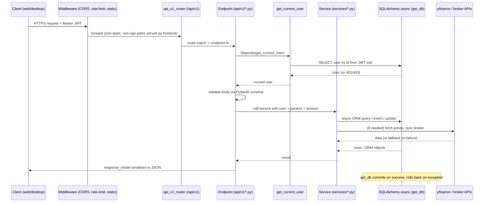
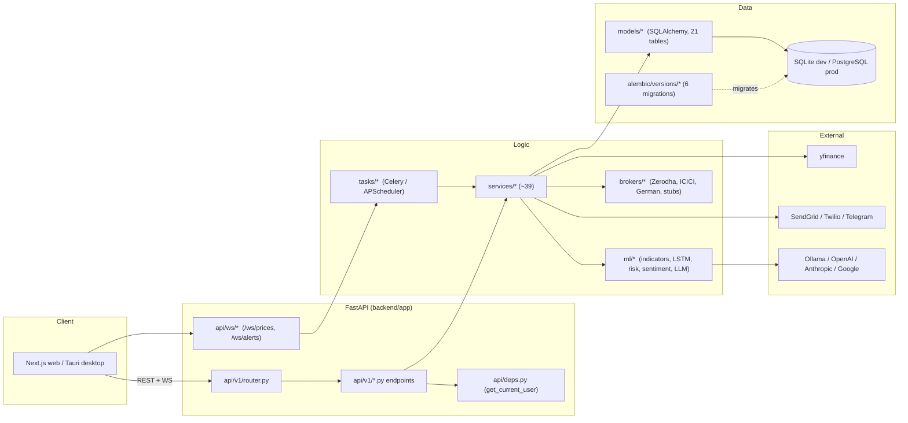

# Developer Guide

> FinanceTracker — A hands-on guide for developers and contributors

This guide gets you from a fresh clone to a running dev environment, explains how
the codebase is laid out, walks through a request end-to-end, documents the
conventions the code already follows, and shows how to add a new feature all the
way from a database table to a sidebar link.

It is the deep-dive companion to [contributing.md](contributing.md) — start there
for the short version (branch naming, commit format, PR checklist, code style),
and come here for the architecture, the request lifecycle, and worked examples.

FinanceTracker is a personal investment portfolio tracker for Indian (NSE/BSE)
and German (XETRA) markets:

- **Backend** — FastAPI + SQLAlchemy 2.0 (fully async), SQLite in dev / PostgreSQL in prod, Alembic migrations, yfinance for market data.
- **Web** — Next.js 15 (App Router) + React 19 + TypeScript + Tailwind CSS 4, Zustand for state.
- **Desktop** — Tauri v2, wrapping the same web frontend and bundling the backend as a sidecar.
- **Monorepo** — pnpm workspace + Turborepo for the JS side, `uv` for the Python side.

---

## 1. Prerequisites

| Tool | Version | Why | Install |
|---|---|---|---|
| **Python** | 3.12+ | Backend runtime (`requires-python = ">=3.12"`) | [python.org](https://python.org) or `pyenv install 3.12` |
| **uv** | latest | Python package/venv manager (replaces pip + venv + poetry) | `curl -LsSf https://astral.sh/uv/install.sh \| sh` |
| **Node.js** | 20+ | Frontend build tooling | [nodejs.org](https://nodejs.org) or `nvm install 20` |
| **pnpm** | 9+ | JS package manager (workspace-native) | `npm install -g pnpm` |
| **Git** | 2.30+ | Version control | [git-scm.com](https://git-scm.com) |
| **Redis** | 7+ | *Optional* — Celery broker for background tasks | `brew install redis` / `apt install redis-server` |
| **Ollama** | latest | *Optional* — local LLM for AI features | [ollama.ai](https://ollama.ai) |
| **Rust** | stable | *Only for the desktop app* | [rustup.rs](https://rustup.rs) |

Everything marked *optional* has a graceful fallback — the core app (portfolios,
holdings, import/export, alerts, charts, tax) runs with just Python + Node
installed. See [§9 Graceful degradation](#9-market-data--graceful-degradation).

---

## 2. Local setup

### Backend

The backend lives in `backend/` and is managed entirely by `uv`. Run every Python
command with `uv run` from inside `backend/` — a bare `python`/`pytest` can pick up
the wrong interpreter or a conflicting global environment.

```bash
cd backend

# Install all dependencies into a local .venv from uv.lock
uv sync

# Copy and edit the environment file (SECRET_KEY warns if left at the dev default)
cp .env.example .env

# Apply database migrations (creates finance.db on first run)
uv run alembic upgrade head

# (Optional) seed a demo user + default portfolio
uv run python -m app --seed          # demo@financetracker.dev / demo1234

# Run the API (recommended — auto-selects a free port if 8420 is taken)
uv run python -m app --port 8420
# or use the repo-root launcher: ./run.sh
```

`uv run python -m app` is the recommended way to run the backend: it auto-advances
to a free port when `8420` is busy and prints which port it chose. A bare
`uv run uvicorn app.main:app --reload --port 8420` still works but cannot
self-select a port.

- API base: `http://localhost:8420/api/v1`
- Interactive Swagger docs: `http://localhost:8420/docs`
- Health check: `http://localhost:8420/health`

#### Automatic port selection

The default backend port is `8420`. `python -m app`, the desktop app, and the
run/start scripts (`run.sh`, `scripts/start.sh`) all try `8420` first and
automatically advance to the next free port (and then an OS-assigned ephemeral
port) if it's already in use — so a co-running app on `8420` or `8000` never
blocks startup and is never killed. Pass `--strict-port` to require the exact
port instead of auto-picking a free one.

To install optional extras, use the dependency groups declared in
`backend/pyproject.toml`:

```bash
uv sync --extra ml            # PyTorch, scikit-learn, scipy, transformers, langchain
uv sync --extra queue         # celery[redis] + redis
uv sync --extra llm-ollama    # langchain-ollama (or llm-openai / llm-anthropic / llm-google)
uv sync --extra notifications # python-telegram-bot + twilio
uv sync --extra all           # everything, including dev tools
```

### Frontend

The web app lives in `apps/web/`. Install dependencies once from the repo root
(pnpm resolves the whole workspace), then run the web dev server:

```bash
# From the repo root
pnpm install

# Start the Next.js dev server on port 3000
pnpm --filter @finance-tracker/web dev
```

- Web app: `http://localhost:3000`
- The web client talks to the backend at `http://localhost:8420/api/v1` (resolved
  by `apps/web/src/lib/tauri-port.ts`; in the browser this defaults to the local
  backend, in the desktop app it reads the sidecar port).

### One-command launcher (`run.sh`)

`run.sh` at the repo root does all of the above — checks prerequisites, installs
deps, runs migrations, starts both servers, and opens the browser:

```bash
./run.sh            # or:  ./run.sh start
./run.sh status     # show running services
./run.sh logs       # tail backend + frontend logs
./run.sh stop       # stop everything
./run.sh restart
```

Under the hood it runs `uv sync`, `pnpm install`, `uv run alembic upgrade head`,
then launches the backend on a free port (preferring `8420`) and
`pnpm --filter @finance-tracker/web dev`, writing PIDs and logs to `logs/`.

`scripts/start.sh` (and `scripts/stop.sh`, `scripts/setup.sh`,
`scripts/health-check.sh`) are the more granular scripts `run.sh` is built from.
Every script has a Windows PowerShell twin (`run.ps1`, `scripts/*.ps1`) — see the
Windows table in [contributing.md](contributing.md#windows-development).

### Optional services

```bash
# Redis (enables the Celery task queue instead of the in-process fallback)
redis-server

# Celery worker + beat (requires the `queue` extra and Redis)
cd backend && uv run celery -A app.tasks.celery_app worker --beat -l info

# Ollama (enables local AI/LLM features)
ollama serve && ollama pull llama3.2
```

### Desktop app (optional)

```bash
# Requires the Rust toolchain; the backend must be running first
cd apps/desktop
pnpm tauri dev
```

For production installers and the sidecar build, see [desktop-app.md](desktop-app.md).

---

## 3. Project structure

```mermaid
flowchart TD
    root["financeTracking/ (pnpm workspace + Turborepo + uv)"]

    root --> backend["backend/ — FastAPI (uv)"]
    root --> apps["apps/"]
    root --> packages["packages/"]
    root --> docs["docs/"]
    root --> scripts["scripts/ + run.sh"]

    backend --> b_app["app/"]
    b_app --> b_api["api/v1/  (REST routers) + api/ws/ (WebSocket)"]
    b_app --> b_models["models/  (SQLAlchemy ORM, 21 tables)"]
    b_app --> b_schemas["schemas/  (Pydantic I/O)"]
    b_app --> b_services["services/  (business logic, ~39 modules)"]
    b_app --> b_ml["ml/  (indicators, LSTM, risk, sentiment, LLM)"]
    b_app --> b_brokers["brokers/  (Zerodha, ICICI, German, stubs)"]
    b_app --> b_tasks["tasks/  (Celery + APScheduler fallback)"]
    b_app --> b_utils["utils/  (security, rate_limiter, audit)"]
    backend --> b_alembic["alembic/versions/  (6 migrations)"]

    apps --> web["web/ — Next.js 15 App Router"]
    apps --> desktop["desktop/ — Tauri v2 (Rust shell)"]
    web --> w_app["src/app/  ((auth) + (dashboard) route groups)"]
    web --> w_components["src/components/"]
    web --> w_stores["src/stores/  (Zustand: auth, portfolio)"]
    web --> w_lib["src/lib/  (api-client, websocket, tauri-port)"]
    web --> w_hooks["src/hooks/  (use-price-stream, keyboard shortcuts)"]

    packages --> ui["ui/ — @finance-tracker/ui shared components + theme"]
```



### Backend (`backend/app/`)

| Path | Contents |
|---|---|
| `main.py` | FastAPI app, lifespan (startup/shutdown), CORS, rate limiting, static-frontend middleware, `/health`. |
| `config.py` | `pydantic-settings` configuration (reads `.env`). |
| `database.py` | Async engine, `async_session_factory`, `get_db` dependency, `Base`. |
| `__main__.py` | CLI entry (`python -m app`) used by the desktop sidecar: runs migrations, additive schema reconciliation, `--seed`. |
| `api/v1/` | One module per resource; each exposes a `router`. `router.py` aggregates them. |
| `api/ws/` | WebSocket endpoints (`price_stream.py`, `alert_stream.py`) + `connection_manager.py`. |
| `api/deps.py` | Shared dependencies — most importantly `get_current_user`. |
| `models/` | SQLAlchemy 2.0 ORM models (one class per table). All are imported in `models/__init__.py`. |
| `schemas/` | Pydantic request/response schemas. |
| `services/` | Business logic. Endpoints stay thin; services own the real work. |
| `ml/` | Optional ML/AI modules (each guarded by `try/except ImportError`). |
| `brokers/` | Broker adapters behind an abstract base class. |
| `tasks/` | `celery_app.py`, `scheduler.py` (APScheduler fallback), `fetch_prices.py`, `check_alerts.py`. |
| `utils/` | `security.py` (JWT, hashing, Fernet), `rate_limiter.py`, `audit.py`. |

### Web (`apps/web/src/`)

| Path | Contents |
|---|---|
| `app/layout.tsx` | Root layout: theme provider, fonts, metadata. |
| `app/(auth)/` | Route group: `login`, `register`, `forgot-password`, `reset-password`. |
| `app/(dashboard)/` | Route group: `layout.tsx` is the app shell (sidebar + top bar); `page.tsx` is the portfolio dashboard; one folder per feature page. |
| `components/` | `layout/` (sidebar, top-bar, notification-center), plus `charts/`, `holdings/`, `dashboard/`, `ai/`, `settings/`, `onboarding/`, `shared/`. |
| `stores/` | Zustand stores: `auth-store.ts`, `portfolio-store.ts`. |
| `lib/` | `api-client.ts` (fetch wrapper + auto-refresh), `websocket.ts`, `tauri-port.ts`, `utils.ts`. |
| `hooks/` | `use-price-stream.ts` (live `/ws/prices` client), `use-keyboard-shortcuts.ts`. |

> Note the App Router uses **route groups** — `(auth)` and `(dashboard)` — whose
> parentheses do not appear in the URL. `app/(dashboard)/holdings/page.tsx` serves
> `/holdings`.

### Packages & desktop

- `packages/ui/` — `@finance-tracker/ui`, shared components + theme tokens + Framer Motion presets, consumed by web (and, through it, desktop).
- `apps/desktop/src-tauri/` — the Rust shell (`Cargo.toml`, `tauri.conf.json`, `src/lib.rs`). The WebView navigates to the backend, which serves the Next.js static export so frontend and API are same-origin.

---

## 4. Request lifecycle

Every authenticated REST call flows through the same layers. The router maps a URL
to an endpoint function; the endpoint validates input with a Pydantic schema,
resolves the current user via `get_current_user`, gets a DB session via `get_db`,
delegates the real work to a service, and returns an ORM object that FastAPI
serialises through a response schema.



A few things worth internalising:

- **`get_db` owns the transaction.** It yields a session, then `commit()`s if the
  handler returns cleanly or `rollback()`s if it raises. Endpoints and services
  usually `flush()` (to populate generated IDs) rather than `commit()` — the final
  commit happens in the dependency teardown.
- **`get_current_user` is the auth boundary.** It decodes the JWT, checks the token
  `type == "access"`, loads the `User`, and rejects deactivated accounts. Any
  endpoint that declares `user: User = Depends(get_current_user)` is protected.
- **Ownership is enforced in the query, not after.** See the pattern in
  [§5 Conventions](#5-conventions).
- **Middleware order** (see `main.py`): the rate limiter and CORS are registered on
  the app, and a `@app.middleware("http")` serves the static frontend for non-API
  paths when a `static/` directory exists (desktop builds) — `/api/`, `/ws/`, and
  `/health` always pass through to FastAPI.

---

## 5. Conventions

### Async SQLAlchemy everywhere

The backend is fully async. Use `select()` + `await db.execute(...)`, never the
legacy `Query` API or sync sessions.

```python
result = await db.execute(select(Holding).where(Holding.id == holding_id))
holding = result.scalar_one_or_none()
```

### Auth + user-scoping / ownership

Protect an endpoint by depending on `get_current_user`, then **scope every query to
the current user in the WHERE clause** — never load a row by ID and check ownership
afterward. This is the pattern used throughout `holdings.py`, `portfolio.py`, etc.:

```python
@router.get("/{holding_id}", response_model=HoldingResponse)
async def get_holding(
    holding_id: int,
    user: User = Depends(get_current_user),
    db: AsyncSession = Depends(get_db),
) -> Holding:
    result = await db.execute(
        select(Holding)
        .join(Portfolio, Holding.portfolio_id == Portfolio.id)
        .where(Holding.id == holding_id, Portfolio.user_id == user.id)  # scope here
    )
    holding = result.scalar_one_or_none()
    if holding is None:
        raise HTTPException(status_code=404, detail="Holding not found")
    return holding
```

Because the ownership predicate is part of the query, another user's row is simply
"not found" — there is no window where you hold a row you shouldn't. `holdings.py`
factors this into `_verify_portfolio_ownership()` and `_get_user_holding()` helpers;
follow that shape.

### Services own the business logic

Endpoints should be thin: validate, authorise, delegate, return. Anything with real
logic — P&L math, tax rules, SIP formulas, market-data fetches — lives in
`services/` (or `ml/`) as plain async functions that take a session and parameters.
Example: `goal_service._calculate_monthly_sip(...)` is a pure function; the goals
endpoint just calls it.

### Pydantic schemas for I/O

Requests and responses are typed with Pydantic models in `schemas/`. Endpoints
declare `response_model=...` so FastAPI validates and serialises consistently and the
OpenAPI docs stay accurate. Use `model_dump(exclude_unset=True)` for PATCH handlers
so only provided fields are updated (see `patch_holding`).

### Frontend conventions

- **API access** goes through the singleton in `lib/api-client.ts`:
  `api.get/post/put/patch/delete/upload`. It injects the `Authorization: Bearer`
  header from `localStorage`, and on a `401` it transparently calls `/auth/refresh`
  once, retries, and otherwise redirects to `/login`. Do not hand-roll `fetch` for
  authenticated calls.
- **State** lives in Zustand stores (`stores/`). `auth-store.ts` holds the user +
  auth actions (login/register/logout/loadUser); `portfolio-store.ts` holds portfolio
  state. Read state with the `useAuthStore` / `usePortfolioStore` hooks.
- **Toasts**: user feedback uses `react-hot-toast` (`toast.success(...)`,
  `toast.error(...)`).
- **Animation**: `framer-motion` for transitions and animated numbers; respect
  reduced-motion.
- **Charts**: TradingView Lightweight Charts v4.2 for candlesticks (note the v4 API —
  `chart.addCandlestickSeries()`, not `addSeries(CandlestickSeries, …)`), Recharts for
  donut/analytics charts. Import chart components dynamically to keep them out of the
  initial bundle.

### Code style

- **Python**: `ruff` (format + lint), line length 100, double quotes, type hints
  required, Google-style docstrings. `uv run ruff format .` and `uv run ruff check
  --fix .`.
- **TypeScript**: ESLint (Next + TS rules), line length 100, semicolons, double
  quotes, trailing commas, function declarations for components, `{Component}Props`
  interfaces. `pnpm --filter @finance-tracker/web lint` and `… typecheck`.

Full style rules and Git/PR workflow: [contributing.md](contributing.md).

---

## 6. Adding a new feature end-to-end

The moving parts for a typical CRUD-ish feature are: **model → migration → schema →
service → endpoint → register in `router.py` → frontend page → sidebar link**. Below
is a concrete worked example: a **"Insurance policies"** tracker (a list of policies
per user, with a premium and renewal date).

### 6.1 Model — `backend/app/models/insurance.py`

```python
from __future__ import annotations

from datetime import date

from sqlalchemy import Date, ForeignKey, Numeric, String
from sqlalchemy.orm import Mapped, mapped_column, relationship

from app.database import Base


class InsurancePolicy(Base):
    __tablename__ = "insurance_policies"

    id: Mapped[int] = mapped_column(primary_key=True)
    user_id: Mapped[int] = mapped_column(
        ForeignKey("users.id", ondelete="CASCADE"), index=True
    )
    provider: Mapped[str] = mapped_column(String(120))
    policy_type: Mapped[str] = mapped_column(String(40))     # LIFE / HEALTH / TERM
    annual_premium: Mapped[float] = mapped_column(Numeric(14, 2))
    renewal_date: Mapped[date] = mapped_column(Date)

    user: Mapped["User"] = relationship(back_populates="insurance_policies")
```

Register it so `Base.metadata` and Alembic autogenerate can see it — add to
`backend/app/models/__init__.py`:

```python
from app.models.insurance import InsurancePolicy  # noqa: F401
```

(If you added the `relationship`, also add the reciprocal
`insurance_policies: Mapped[list["InsurancePolicy"]] = relationship(...)` on `User`.)

### 6.2 Migration — Alembic

```bash
cd backend
uv run alembic revision --autogenerate -m "add insurance_policies table"
# Review the generated file in alembic/versions/ — autogenerate is not always right
uv run alembic upgrade head
```

Always read the generated migration and confirm both `upgrade()` and `downgrade()`.
See [§7 Migrations](#7-database-migrations).

### 6.3 Schema — `backend/app/schemas/insurance.py`

```python
from __future__ import annotations

from datetime import date

from pydantic import BaseModel, ConfigDict


class InsuranceCreate(BaseModel):
    provider: str
    policy_type: str
    annual_premium: float
    renewal_date: date


class InsuranceResponse(InsuranceCreate):
    model_config = ConfigDict(from_attributes=True)
    id: int
```

### 6.4 Service — `backend/app/services/insurance_service.py`

```python
from __future__ import annotations

from sqlalchemy import select
from sqlalchemy.ext.asyncio import AsyncSession

from app.models.insurance import InsurancePolicy
from app.schemas.insurance import InsuranceCreate


async def list_policies(db: AsyncSession, user_id: int) -> list[InsurancePolicy]:
    result = await db.execute(
        select(InsurancePolicy)
        .where(InsurancePolicy.user_id == user_id)
        .order_by(InsurancePolicy.renewal_date)
    )
    return list(result.scalars().all())


async def create_policy(
    db: AsyncSession, user_id: int, body: InsuranceCreate
) -> InsurancePolicy:
    policy = InsurancePolicy(user_id=user_id, **body.model_dump())
    db.add(policy)
    await db.flush()          # populate policy.id; get_db commits at request end
    await db.refresh(policy)
    return policy
```

### 6.5 Endpoint — `backend/app/api/v1/insurance.py`

```python
from __future__ import annotations

from fastapi import APIRouter, Depends, status
from sqlalchemy.ext.asyncio import AsyncSession

from app.api.deps import get_current_user
from app.database import get_db
from app.models.user import User
from app.schemas.insurance import InsuranceCreate, InsuranceResponse
from app.services import insurance_service

router = APIRouter()


@router.get("/", response_model=list[InsuranceResponse])
async def list_insurance(
    user: User = Depends(get_current_user),
    db: AsyncSession = Depends(get_db),
):
    return await insurance_service.list_policies(db, user.id)


@router.post("/", response_model=InsuranceResponse, status_code=status.HTTP_201_CREATED)
async def create_insurance(
    body: InsuranceCreate,
    user: User = Depends(get_current_user),
    db: AsyncSession = Depends(get_db),
):
    return await insurance_service.create_policy(db, user.id, body)
```

### 6.6 Register in `router.py`

Add the import and `include_router` call in `backend/app/api/v1/router.py`:

```python
from app.api.v1 import (
    ...,
    insurance,   # <-- add to the import block
)

api_v1_router.include_router(insurance.router, prefix="/insurance", tags=["Insurance"])
```

The endpoints are now live at `/api/v1/insurance` and appear in `/docs`.

### 6.7 Frontend page — `apps/web/src/app/(dashboard)/insurance/page.tsx`

```tsx
"use client";

import { useEffect, useState } from "react";
import toast from "react-hot-toast";
import { api } from "@/lib/api-client";

interface Policy {
  id: number;
  provider: string;
  policy_type: string;
  annual_premium: number;
  renewal_date: string;
}

export default function InsurancePage() {
  const [policies, setPolicies] = useState<Policy[]>([]);

  useEffect(() => {
    api
      .get<Policy[]>("/insurance/")
      .then(setPolicies)
      .catch((e) => toast.error(e.message));
  }, []);

  return (
    <div className="space-y-4">
      <h1 className="text-2xl font-semibold">Insurance</h1>
      {policies.map((p) => (
        <div key={p.id} className="rounded-lg border p-4">
          {p.provider} — {p.policy_type} — renews {p.renewal_date}
        </div>
      ))}
    </div>
  );
}
```

### 6.8 Sidebar link — `apps/web/src/components/layout/sidebar.tsx`

Add an item to the appropriate `NAV_SECTIONS` group (icons come from
`lucide-react`):

```tsx
// inside the "Planning" section's items array
{ href: "/insurance", label: "Insurance", icon: ShieldCheck },
```

### 6.9 Tests

- Backend: add `backend/tests/test_insurance.py` using the async `httpx.AsyncClient`
  fixture and `auth_headers` (see existing tests). Mock any external calls.
- Frontend: add a Playwright smoke test in `apps/web/e2e/` that logs in and visits
  `/insurance`.

That is the whole loop. Most real features touch the same files; the only variation
is how much lives in the service.

---

## 7. Database migrations

Schema changes are managed by **Alembic**. Migrations live in
`backend/alembic/versions/`; `alembic/env.py` imports all models and points
`target_metadata` at `Base.metadata`, so autogenerate diffs your models against the
DB. There are currently **6 migrations** (head `d2e3f4a5b6c7`).

```bash
cd backend

# 1. Generate a migration from model changes
uv run alembic revision --autogenerate -m "describe your change"

# 2. Review the generated file — autogenerate misses/miswrites things
#    (esp. SQLite type changes, server defaults, data migrations)

# 3. Apply it
uv run alembic upgrade head

# 4. Test the rollback path, then re-apply
uv run alembic downgrade -1
uv run alembic upgrade head
```

Rules:

- Always hand-review autogenerated migrations before committing.
- One migration per logical change; fill in both `upgrade()` and `downgrade()`.
- Commit the migration file alongside the model change in the same PR.

### Additive schema reconciliation on startup

Separate from Alembic, the desktop sidecar entry point (`app/__main__.py`) has a
safety net so that a database created by an **older** app version keeps working after
a user installs a **newer** build — even if it was originally created by
`create_all()` with no `alembic_version` table.

`_run_migrations()` handles three cases:

1. **Fresh install** — no DB: Alembic runs all migrations.
2. **Normal upgrade** — DB has `alembic_version`: only pending migrations run.
3. **Legacy DB** — app tables but no `alembic_version`: stamp at `head` so existing
   tables aren't recreated.

Then `_reconcile_schema()` runs an **additive** pass: it calls
`Base.metadata.create_all()` (creates any brand-new tables) and, for every existing
table, `ALTER TABLE … ADD COLUMN` for any model column the DB is missing (nullable,
or with the model's scalar default). It **never** drops, renames, or rewrites
anything — existing data is untouched — and it never blocks startup on error. This is
what lets an old `finance.db` survive an in-place app upgrade.

> This reconciliation is a resilience net for the packaged desktop app, not a
> replacement for Alembic. In dev, always write a real migration for schema changes.

`app/main.py`'s lifespan also calls `create_tables()` on startup, which creates any
missing tables (but not missing columns) — enough to boot a fresh dev DB, though
`alembic upgrade head` is the canonical path.

---

## 8. Testing

### Backend (pytest)

```bash
cd backend

uv run pytest                 # full suite — 352 passing (1 skipped)
uv run pytest -v              # verbose
uv run pytest tests/test_holdings.py -v
uv run pytest -k "tax" -v     # match by name
uv run pytest --cov=app --cov-report=html
```

- Config lives in `pyproject.toml`: `asyncio_mode = "auto"`, `testpaths = ["tests"]`.
- Endpoint tests use `httpx.AsyncClient` against the app with an `auth_headers`
  fixture; shared fixtures (test DB, client, user) are in `tests/conftest.py`.
- **Always run from `backend/` with `uv run`** — a bare `pytest` from the repo root
  can pull in an unrelated global environment.
- Mock external services (yfinance, broker APIs) — tests must not hit the network.
- The rate limiter is disabled in tests (`limiter.enabled = False` in conftest) so
  auth tests don't trip the 5/10/20-per-minute limits.

### Frontend build + type/lint checks

There is no unit-test runner (no vitest/jest). The gate for frontend changes is a
clean build plus lint/typecheck:

```bash
pnpm --filter @finance-tracker/web build       # must build clean (~47 static routes)
pnpm --filter @finance-tracker/web lint
pnpm --filter @finance-tracker/web typecheck
```

### End-to-end (Playwright)

```bash
# First time: install browsers
pnpm --filter @finance-tracker/web exec playwright install

pnpm --filter @finance-tracker/web test:e2e       # headless
pnpm --filter @finance-tracker/web test:e2e:ui    # UI mode
```

E2E specs live in `apps/web/e2e/`. Cover new pages/flows with at least a smoke test.

> ⚠️ **Do not run the E2E suite against a real / production database.** The tests
> register users, create portfolios, and mutate data. Point them at a disposable dev
> database (a throwaway `finance.db` or an ephemeral instance) and never at anything
> holding real holdings, tax records, or credentials.

---

## 9. Market data & graceful degradation

### yfinance / market data

All live and historical prices come from **yfinance** — there is no real-time broker
price feed (broker connections are used only to sync holdings). The service layer
wraps yfinance so the async event loop is never blocked and failures degrade
gracefully.

- **Exchange → suffix mapping** (`market_data_service._EXCHANGE_SUFFIX`): NSE →
  `.NS`, BSE → `.BO`, XETRA → `.DE`. `_ticker_symbol("TCS", "NSE")` → `"TCS.NS"`.
- **Off-thread + timeout**: yfinance is synchronous, so calls run via
  `asyncio.to_thread(...)` wrapped in `asyncio.wait_for(..., timeout=15.0)`. On
  timeout the function returns a well-formed quote dict with `None` prices rather
  than raising.
- **fast_info first, `.info` fallback**: `fetch_current_price` reads
  `ticker.fast_info` and falls back to the slower `ticker.info` if that fails.
- **Prices are cached in the DB**: fetched prices are written to `price_history`;
  when a live fetch fails, the last known price is served with a stale flag (see the
  freshness service).

### Graceful degradation everywhere

Every external dependency has a fallback so the core app runs with nothing optional
installed:

| Dependency | If missing/unavailable | Fallback |
|---|---|---|
| Redis / Celery | not installed | APScheduler `AsyncIOScheduler` runs the same jobs in-process |
| Ollama / LLM | not installed | AI pages show an "AI offline" state; everything else works |
| yfinance | rate-limited / timeout | last cached price with a stale timestamp |
| Broker API | connection fails | manual entry; "broker disconnected" badge |
| SendGrid / Twilio / Telegram | not configured | that notification channel is disabled; others work; in-app always works |
| PostgreSQL | not available | SQLite (the dev default) |
| Internet (desktop) | offline | cached data with an "offline" indicator |

Implementation pattern: optional ML/broker/LLM modules are imported behind
`try/except ImportError`, and network calls are wrapped in `try/except` that logs and
returns a safe default. When you add a feature that depends on an optional service,
follow the same pattern — never let a missing optional dependency break an unrelated
page or crash startup.

### Background tasks

Two periodic jobs drive the live data: `fetch_prices` (every ~5 min) and
`check_alerts` (every ~1 min). When Redis + Celery are available they run under
Celery beat (`tasks/celery_app.py`); otherwise `tasks/scheduler.py` starts an
APScheduler `AsyncIOScheduler` inside the FastAPI process running the same logic.
Price and alert updates are pushed to clients over the WebSocket channels
`/ws/prices` and `/ws/alerts`; the web client subscribes via the `use-price-stream`
hook (auto-reconnect with backoff).

---

## 10. Where things live (quick module map)



At a glance:

- **REST**: 29 resource routers under `api/v1/`, aggregated by `router.py`, mounted at `/api/v1`.
- **WebSocket**: 2 channels — `/ws/prices`, `/ws/alerts`.
- **Models**: 21 SQLAlchemy tables in `models/`.
- **Services**: ~39 modules in `services/` (plus 9 in `ml/`).
- **Migrations**: 6, head `d2e3f4a5b6c7`.
- **Frontend**: ~38 `page.tsx` files across the `(auth)` and `(dashboard)` route groups.
- **Tests**: 352 backend tests passing, plus Playwright E2E.

---

## Related documentation

- [Contributing Guide](contributing.md) — code style, Git/PR workflow, Windows scripts (the short version of this guide).
- [Architecture](architecture.md) — full system design and data-flow diagrams.
- [API Reference](api-reference.md) — every endpoint and WebSocket channel.
- [Database Schema](database-schema.md) — table definitions and relationships.
- [Desktop App](desktop-app.md) — Tauri build, sidecar, installers.
- [ML/AI Models](ml-models.md) — the models behind the `ml/` layer.
- [Deployment](deployment.md) — dev and production deployment.
- [Security](security.md) — auth, encryption, and the password-reset flow.
