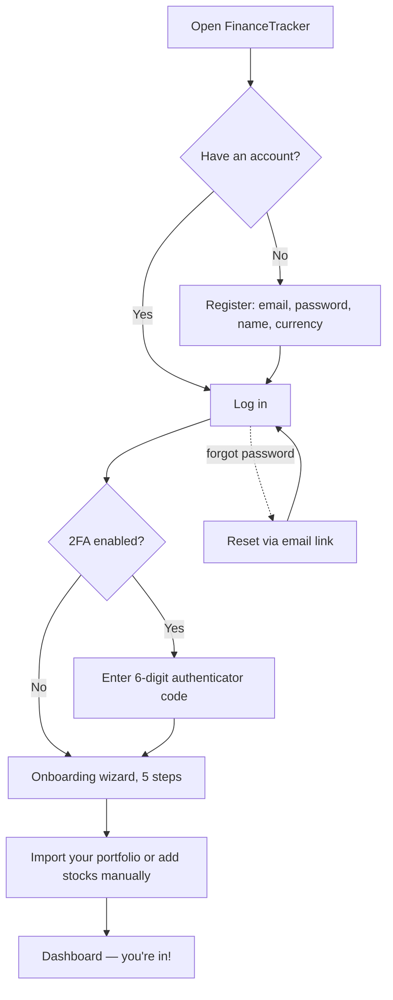

# FinanceTracker — Complete User Manual

> Your friendly, step-by-step guide to tracking, understanding, and growing your investments across Indian (NSE/BSE) and German (XETRA) markets.

This manual is written for **you, the investor** — not for programmers. You do not need to know anything technical. Every feature is explained in plain language, with numbered steps you can follow along on screen. Keep it open in a second window the first few times you use the app, and skim the parts you need.

If you ever get stuck, jump to [Troubleshooting & FAQ](#19-troubleshooting--faq) at the end.

---

## Table of Contents

1. [Introduction — What This App Is & Who It's For](#1-introduction--what-this-app-is--who-its-for)
2. [Getting Started](#2-getting-started)
3. [The Dashboard](#3-the-dashboard)
4. [Portfolios](#4-portfolios)
5. [Holdings & Transactions](#5-holdings--transactions)
6. [Watchlist & Alerts](#6-watchlist--alerts)
7. [Charts](#7-charts)
8. [Taxes](#8-taxes)
9. [Mutual Funds & Dividends](#9-mutual-funds--dividends)
10. [Net Worth](#10-net-worth)
11. [Analytics & Risk](#11-analytics--risk)
12. [Planning](#12-planning)
13. [Discovery](#13-discovery)
14. [AI Assistant](#14-ai-assistant)
15. [Brokers](#15-brokers)
16. [Import, Export & Reports](#16-import-export--reports)
17. [Settings](#17-settings)
18. [The Desktop App](#18-the-desktop-app)
19. [Troubleshooting & FAQ](#19-troubleshooting--faq)
20. [Keyboard Shortcuts & Handy Tips](#20-keyboard-shortcuts--handy-tips)

---

## 1. Introduction — What This App Is & Who It's For

**FinanceTracker** is a personal investment portfolio tracker built for retail investors in **India** and **Germany**. It brings everything about your money into one place: your stocks, mutual funds, dividends, other assets (gold, crypto, fixed deposits, real estate), your taxes, and your long-term goals.

### What makes it different

- **Two markets, one app.** It understands the NSE and BSE (India) and XETRA (Germany), including the quirks of each — the exchange suffixes, the currencies (₹ and €), and each country's tax rules.
- **Colour-coded "action needed" system.** Instead of staring at rows of numbers, each stock lights up in colour when it crosses a price zone you care about, so you can tell at a glance what needs your attention.
- **You own your data.** In the desktop app everything runs locally on your own computer — your holdings never leave your machine, and the AI assistant can run fully offline.
- **Graceful, not fragile.** Live prices, AI, brokers, and notifications are all optional add-ons. If any of them is unavailable, the rest of the app keeps working normally.

### Who it's for

- Long-term investors who want a clear picture of their whole portfolio.
- People who currently track investments in a spreadsheet and want something smarter (you can import your Excel file directly).
- Anyone managing **both** Indian and German holdings and tired of juggling two systems.
- Investors who want tax estimates, dividend forecasts, and goal planning without hiring an advisor.

### How to read this manual

Each section maps to an area of the app's left-hand sidebar. You do not need to read it front to back — set up your account (Section 2), get your holdings in (Section 5 or 16), then explore whatever interests you.

> **A word on the numbers:** Prices come from public market data (via yfinance) and can be delayed. Tax figures, dividend forecasts, risk metrics, and AI insights are **estimates to help you think**, not financial or tax advice. Always confirm important decisions with a qualified professional.

---

## 2. Getting Started

This section takes you from zero to a working account: creating your login, signing in, turning on extra security, recovering a forgotten password, and the guided tour that greets you on first launch.

### The big picture



### 2.1 Create your account (Register)

1. Open FinanceTracker — in a browser at `http://localhost:3000`, or by launching the **desktop app**.
2. On the login screen, click **Register** (or "Create an account").
3. Enter your **email address**, choose a **strong password**, and set a **display name** (this is just how the app greets you).
4. Pick your **preferred currency** — **INR** (₹) if you invest mainly in India, or **EUR** (€) for Germany. This becomes your account's base currency; you can still view totals in other currencies later.
5. Click **Create Account**. You'll be signed in automatically.

> **Tip:** Use a password you don't reuse anywhere else. If you plan to add 2FA (recommended), have your authenticator app ready — see 2.3.

### 2.2 Log in

1. On the login screen, enter your **email** and **password**.
2. If you have Two-Factor Authentication turned on, you'll also be asked for the **6-digit code** from your authenticator app.
3. Click **Sign In**.

The app keeps you signed in and quietly refreshes your session in the background. If your session ever expires, you'll simply be asked to log in again.

### 2.3 Turn on Two-Factor Authentication (2FA)

2FA adds a second lock to your account: even if someone learns your password, they can't get in without your phone.

1. Go to **Settings** in the sidebar, then the **Security** section.
2. Click **Set up Two-Factor Authentication**.
3. Open an authenticator app (Google Authenticator, Authy, 1Password, etc.) and either **scan the QR code** shown or type in the **secret key** by hand.
4. Your authenticator now shows a rotating 6-digit code. Type the current code into the app to **confirm** and finish setup.
5. **Save your backup codes.** The app now shows **10 one-time backup codes**. Download or copy them and keep them somewhere safe — they're shown **only once**. Each code can be used **once** to log in if you ever lose your phone.
6. From now on, that code is required every time you log in.

**To turn 2FA off later:** return to Settings → Security, choose **Disable**, and enter a current code to confirm.

**If you lose your phone:** on the login screen, choose to enter a **backup code** instead of the 6-digit authenticator code. Each backup code works **once**. In **Settings → Security** you can check **how many codes remain** and **regenerate** a fresh set of 10 at any time (regenerating replaces any unused codes).

> **Tip:** Store the secret key somewhere safe (a password manager), and keep your **backup codes** with it — either one will get you back in if you lose your phone.

### 2.4 Forgot your password?

1. On the login screen, click **Forgot password?**.
2. Enter the **email** on your account and click **Send reset link**.
3. For your privacy, the app always says *"if that email exists, a reset link was sent"* — it never reveals whether an email is registered.
4. Open the reset link you receive, choose a **new password** (at least 8 characters), confirm it, and save.
5. Return to the login screen and sign in with the new password.

### 2.5 The onboarding wizard (first-launch tour)

The very first time you log in, a friendly 5-step overlay walks you through the basics. You can click **Skip** (the ✕ in the corner) at any point and come back to any feature later.

1. **Welcome** — a quick hello and what the app is for.
2. **Import your portfolio** — jump straight to importing an Excel file, or choose **Add manually** to enter stocks one at a time. (You can also skip and do this later.)
3. **Your dashboard** — a preview of the colour coding, so you know at a glance what green and red mean (large gain, moderate gain, neutral, moderate loss, large loss).
4. **Stay informed** — a pointer to Settings where you set up alerts and notifications (email, push, in-app).
5. **You're all set!** — a little confetti, then a button straight to your dashboard.

> **Tip:** The wizard only appears once. To re-explore, use the **Help** section in the sidebar or the **?** button, and read the relevant section of this manual.

---

## 3. The Dashboard

The dashboard is your home base — the page you land on after logging in. It gives you the whole picture in one glance, then lets you drill in.

### 3.1 The top bar (always visible)

Running across the top of every page:

- **Portfolio selector** — a dropdown to switch between your portfolios (see [Section 4](#4-portfolios)).
- **Display-currency dropdown** — pick **INR / EUR / USD** to convert the totals shown on screen into that currency *for viewing only*. It does **not** change how your holdings are stored or your account's base currency. Great for a quick "what's this worth in euros?" check.
- **New portfolio** button (the **+**) — create another portfolio without leaving the page.
- **Refresh** button (the circular arrow) — fetch the latest prices on demand. A toast tells you how many stocks were updated.
- **Theme toggle** (sun/moon) — switch between light and dark.
- **Notification bell** — your in-app notification centre (see 3.4).
- **Your name & sign-out** — on the far right.

### 3.2 Summary & performance cards

At the top of the dashboard you'll see cards that update with smooth animated transitions:

- **Total Portfolio Value** — the current market value of everything you hold.
- **Day's P&L** — how much you gained or lost today, in both amount and percentage.
- **Top Gainer / Top Loser** — your best and worst performers today.
- **XIRR card** — your portfolio's *money-weighted annualised return*. Unlike a simple percentage, XIRR accounts for **when** you invested each amount, so it's the fairest single number for "how am I really doing?"
- **Benchmark card** — how your portfolio stacks up against a market index such as **NIFTY50** (India), **SENSEX**, **DAX** (Germany), **S&P 500**, or **NASDAQ**.

### 3.3 Live prices

Where live streaming is available, prices update **automatically** over a live connection (you'll see numbers tick without doing anything). When streaming isn't available, the app refreshes prices on a short interval instead. Either way, you can always press the **Refresh** button in the top bar to pull fresh prices right now.

### 3.4 The notification bell

The **bell icon** in the top bar is your in-app notification centre:

- A **red badge** shows how many alerts have triggered since you last looked.
- Click the bell to open the panel and read your recent triggered alerts (stock, message, and time).
- Opening the panel marks everything as seen and clears the badge.

This works even if you haven't set up email or messaging — every triggered alert is logged here.

### 3.5 The holdings table & heatmap

Below the cards is your **holdings table** — the heart of the dashboard — and a **heatmap** where each stock is a rectangle sized by its weight and coloured by performance (green for gains, red for losses). Both are covered in detail in [Section 5](#5-holdings--transactions).

---

## 4. Portfolios

A **portfolio** is a container for a set of holdings. Most people keep separate portfolios for different purposes — for example one for **Indian long-term stocks** and another for **German ETFs** — so their currencies, taxes, and performance stay cleanly separated.

### 4.1 Create a new portfolio

1. In the **top bar**, click **New portfolio** (the **+** button).
2. In the dialog, enter a **Name** (e.g. "India Long Term").
3. Choose the **Currency**: **INR (₹)**, **EUR (€)**, or **USD ($)**.
4. Optionally tick **Set as default portfolio** — the default is the one that loads first when you open the app.
5. Click **Create**. The new portfolio is created and selected immediately.

### 4.2 Switch between portfolios

Use the **portfolio selector** dropdown in the top bar. Every page — dashboard, holdings, tax, risk, and so on — updates to reflect the portfolio you've selected.

### 4.3 The default portfolio

The **default** portfolio is the one shown when you first log in. To change it, create a portfolio with **Set as default** ticked, or update the setting when editing a portfolio.

> **Tip:** Keep currencies consistent within a portfolio. Put your ₹ holdings in an INR portfolio and your € holdings in a EUR one; then use the top-bar **display-currency** dropdown whenever you want to eyeball a combined figure in a single currency.

---

## 5. Holdings & Transactions

This is where your actual investments live. A **holding** is a stock you own; each holding is built from one or more **transactions** (buys and sells). The app keeps your cumulative quantity and average price up to date automatically.

### 5.1 Add a stock

1. Open **Holdings** (or the dashboard) and click **+ Add Stock**.
2. Start typing the stock name or symbol — a **search dropdown** appears with matches. Pick your stock (e.g. "Reliance Industries — NSE").
3. Enter the **purchase details**: date, quantity, and price.
4. Optionally set your **range levels** (base level, mid ranges, top level) — these power the colour-coded action system (see 5.5).
5. Click **Add**. The stock appears in your table with its current price fetched automatically.

### 5.2 Add a transaction to an existing stock

1. Find the stock in your holdings table and open its **detail view** (click the row).
2. Click **+ Add Transaction**.
3. Choose **BUY** or **SELL**.
4. Enter the **date, quantity, and price**.
5. Click **Save**. Your cumulative quantity and weighted-average price recalculate instantly.

Recording your **sells** matters — they feed the tax calculations (capital gains) in [Section 8](#8-taxes).

### 5.3 Edit or delete a holding

- **Edit:** open the **Edit Holding** dialog on the Holdings page to change details, range levels, **Target %** (for allocation-drift alerts), and **Stop-Loss** (see 5.6).
- **Inline edits:** you can click directly on a range value in the table (base, mid ranges, top) to edit it in place — press **Enter** to save.
- **Delete:** remove a holding (and optionally its transactions) from its row's menu.

### 5.4 Bulk edit

On the Holdings page, switch on **bulk edit mode** to show checkboxes. Select several holdings and a floating toolbar lets you apply actions to all of them at once — handy for tidying up range levels or tags across many stocks.

### 5.5 The 5-zone "action needed" colour system

This is the app's signature feature. For each stock you define price **zones**; the app then colours the row and sets an **Action Needed** flag (Y/N) based on where the current price sits.

You set these levels per stock:

- **Base Level** — the lowest price you're comfortable with (critical support).
- **Lower Mid Range 2 / 1** — your caution band, below your comfort zone.
- **Upper Mid Range 1 / 2** — your opportunity band, above the normal zone.
- **Top Level** — your target price (where you might take profit).

```mermaid
flowchart LR
    subgraph Price zones, low to high
    DR[Dark Red<br/>at/below Base] --> LR[Light Red<br/>lower mid range]
    LR --> N[No colour<br/>normal zone]
    N --> LG[Light Green<br/>upper mid range]
    LG --> DG[Dark Green<br/>at/above Top]
    end
```

| Colour | Action | What it's telling you | What you might do |
|---|---|---|---|
| **No colour** | N | Price is in the normal range | Relax, nothing needed |
| **Light Red** | Y | Entered the lower mid (caution) zone | Watch closely; consider buying the dip |
| **Dark Red** | Y | At or below your base level (critical) | Serious attention; re-evaluate the position |
| **Light Green** | Y | Entered the upper mid (opportunity) zone | Consider booking partial profits |
| **Dark Green** | Y | At or above your top level (target hit) | Consider selling — your target is met |

**Visual cues:** light-red and light-green cells gently pulse to catch your eye; dark-red shows a warning icon; dark-green shows a celebration icon. When a stock crosses a zone, the app updates the colour immediately, can send you a notification, and logs it in your notification history.

> The dashboard **heatmap** uses a separate, simpler colour scale based purely on today's gain/loss (large loss → neutral → large gain). Don't confuse it with the zone colours in the table — the heatmap is about *performance*, the table colours are about *your chosen action zones*.

### 5.6 Stop-loss

1. Open the **Edit Holding** dialog and set a **Stop-Loss** price.
2. A stop-loss pill appears on that stock's row; it turns **red** when the current price falls to or below your stop-loss level.
3. To remove it, clear the field.

### 5.7 Custom columns

You control which columns the holdings table shows and in what order.

1. Go to **Settings → Display → Customize Columns**.
2. Toggle **built-in columns** on/off (Sector, P&L amount, Volume, Dividend Yield, and more — 13 built-ins in total).
3. Click **+ Add Custom Column** to create your own (give it a name and a type: text, number, or date).
4. **Drag** columns to reorder them.

The default columns are: **Stock**, **Quantity**, **Avg Price**, **Current Price**, **P&L %**, **Action Needed**, and **RSI** (a momentum indicator — see [Charts](#7-charts)).

---

## 6. Watchlist & Alerts

Track stocks you're *thinking* about, and get told when *anything* you care about happens — on any channel you like.

### 6.1 Watchlist — stocks you don't own yet

1. Go to **Watchlist** in the sidebar and click **+ Add to Watchlist**.
2. Search for a stock and set your **desired buy price** and **range levels**.
3. The same colour-coded zone system applies, so a watchlist stock lights up when it enters your buy zone.
4. When you're ready, use **Add to Portfolio** to convert it into a holding.

### 6.2 Alerts — get notified automatically

Go to **Alerts** in the sidebar to create rules that watch your holdings and ping you when a condition is met.

**Create an alert:**

1. Choose the **holding** the alert is about.
2. Pick an **alert type**:
   - **Price Range** — trigger when the price crosses a threshold (above or below a value you set).
   - **RSI** — trigger when the momentum indicator (RSI 14) rises above or falls below a level you set (commonly 70 for overbought, 30 for oversold).
3. Set the **direction** (above/below) and the **threshold**.
4. Choose the **notification channel** (see 6.3).
5. Save. You can edit, change channels for, or delete any alert later.

**Alert history:** a history list shows every time your alerts have fired — the same data behind the top-bar notification bell.

### 6.3 Notification channels & per-user destinations

Alerts can reach you on any of these channels:

- **In-App** — always available; shows in the notification bell. No setup needed.
- **Email** — via SendGrid.
- **Telegram** — via a Telegram bot.
- **WhatsApp** — via Twilio.
- **SMS** — via Twilio.

The messaging channels use **your own destination**: your **phone number** (for WhatsApp/SMS) and your **Telegram chat ID** (detected automatically when you message the bot). Set these up once in **Settings → Notifications**; see [Section 17](#17-settings) for the step-by-step for each channel and the **Test** buttons that confirm they work.

> **Tip:** Route noisy, routine alerts (light red / light green) to **In-App + Email**, and reserve **Telegram/WhatsApp/SMS** for the critical ones (dark red / dark green) so your phone only buzzes when it really matters.

### 6.4 Allocation-drift alerts

The Alerts page also has an **Allocation Drift** section. If you've set a **Target %** on a holding (in the Edit Holding dialog), this section flags any stock whose actual weight has drifted **beyond** your target — a minor drift up to 10%, a **major** drift beyond that — so you know when it's time to rebalance.

### 6.5 The notification centre

The **bell** in the top bar collects every triggered alert in one place, with an unread badge. See [3.4](#34-the-notification-bell).

---

## 7. Charts

Charts help you see a stock's story over time and how it sits against the zones you set.

### 7.1 Open a chart

Click a stock's **name** or its **Action Needed** cell, or go to the **Charts** page in the sidebar and pick a symbol.

### 7.2 Price (candlestick) chart

- **Candlesticks** — each candle is one day. **Green** = closed higher than it opened; **red** = closed lower. The thick **body** is the open-to-close range; the thin **wicks** are the day's high and low.
- **Volume bars** at the bottom show how many shares traded each day.
- **Horizontal lines** mark your range levels (base, mid ranges, top) so you can see where price is relative to your zones.

### 7.3 RSI chart

The **RSI** (Relative Strength Index) is a momentum gauge from 0 to 100:

- **Above 70** (red zone): possibly **overbought** — price may cool off.
- **Below 30** (green zone): possibly **oversold** — price may bounce.
- **30–70**: normal territory.

Click the **RSI** cell in your holdings table to jump straight to a stock's RSI chart.

### 7.4 Time periods & indicator overlays

- **Time period buttons** — **7d, 30d (default), 90d, 1Y, All**.
- **Overlays** you can toggle for deeper analysis: **Moving Averages** (SMA/EMA), **Bollinger Bands** (the normal price band), **MACD** (trend-change momentum), and **Fibonacci** levels (mathematical support/resistance).

---

## 8. Taxes

FinanceTracker estimates your capital-gains tax for **both** India and Germany, following each country's actual rules, and produces a report you can hand to your accountant. Open **Tax** in the sidebar; use the **India / Germany** tabs and the **financial-year selector** at the top.

> These are **estimates** to help you plan. Always confirm with a tax professional before filing.

### 8.1 Indian capital-gains tax

- **STCG (Short-Term Capital Gains):** for stocks held **under 12 months**, taxed at **20%**.
- **LTCG (Long-Term Capital Gains):** for stocks held **over 12 months**, taxed at **12.5%**, with the first **₹1.25 lakh of long-term gains exempt each financial year**.
- **FIFO matching:** when you sell, gains are matched **lot by lot** on a first-in-first-out basis, so each sale is paired with your oldest remaining shares — exactly as the tax rules require.
- **31-January-2018 grandfathering:** for long-term gains on shares bought before 1 Feb 2018, the app applies the grandfathered cost basis (the higher of your actual cost and the 31-Jan-2018 fair market value, capped at the sale price) where it lowers your taxable gain.
- India's financial year runs **April–March**.

### 8.2 German capital-gains tax

Switch to the **Germany** tab to see two extra panels alongside the summary:

- **Abgeltungssteuer** — a flat **26.375%** on capital gains (25% plus the solidarity surcharge).
- **Teilfreistellung (partial exemption)** — for fund holdings, a portion of the gain is tax-free depending on the fund type: **equity funds 30%**, **mixed funds 15%**, **real-estate funds 60%**. Set a **fund type** on a holding (or import it) and the exemption is applied automatically.
- **Sparer-Pauschbetrag (tax-free allowance)** — a progress bar showing how much of your annual allowance you've used. A **Single / Joint** toggle switches the allowance between **€1,000** (single) and **€2,000** (jointly assessed couples). The netting of gains against your allowance honours both the joint setting and any Teilfreistellung.
- **Estimated Vorabpauschale** — an estimate of the *advance lump-sum tax* charged on accumulating funds, calculated from the official Basiszins (base-rate) table. Set a fund type on your XETRA fund holdings to see it.

### 8.3 The tax dashboard

The Tax page shows, for the selected year and country:

- A **year-wise summary** of gains and losses.
- The **STCG vs LTCG** breakdown (India).
- **Tax-harvesting suggestions** — "sell these losing positions to offset gains and reduce your bill."

### 8.4 The ITR-ready capital-gains tax report

You can download a consolidated report suitable for filing:

1. Go to the **Reports** page in the sidebar.
2. Find the **Capital Gains Tax Report** card.
3. Pick the **financial year** and the **jurisdiction** (India or Germany).
4. Download as **CSV** or **HTML**. The report lists per-transaction gains plus STCG/LTCG, tax, and exemption totals — ready to review or forward to your accountant.

You can also **bulk import/export tax records** as CSV from the Import and Reports pages (see [Section 16](#16-import-export--reports)).

### 8.5 Holding Period Timer (India)

Selling an Indian holding *just before* it crosses the one-year mark can cost you real money — the gain is taxed as **STCG at 20%** instead of **LTCG at 12.5%**. The **Holding Period Timer** card on the Tax page helps you avoid that trap.

- Each of your **lots** (shares bought on a given date) is listed with the **number of days** until it has been held **over 12 months** and becomes **LTCG-eligible**.
- Lots are sorted **soonest-first**, so the ones about to cross the line sit at the top.
- Each row shows an **estimated tax saving** — how much less tax you'd pay by waiting for that lot to qualify (the 20% vs 12.5% difference on its current gain).
- Lots that are **already eligible** are **badged** as such, so you can see at a glance which sales would already be long-term.

> **Tip:** This is a planning aid, not a nudge to hold or sell. A stock can fall by more than the tax you'd save while you wait — weigh the timer against the actual price.

---

## 9. Mutual Funds & Dividends

### 9.1 Mutual funds

Open **Mutual Funds** in the sidebar.

1. **Add funds** — enter them manually, or **bulk-import** from a CSV (a template is available on the Import page).
2. **Refresh NAV** — pull the latest Net Asset Value from mfapi.in.
3. **XIRR** — your money-weighted annualised return across your funds appears in the summary.
4. **Overlap X-Ray** — see how much your funds hold the *same* underlying stocks (a look-through analysis), shown as a heatmap plus a list of the top common holdings. Two funds with heavy overlap mean you're less diversified than you think.
5. **Fee Analyzer** — your weighted **expense ratio** and the projected **fee drag** over 5, 10, and 20 years, with high-fee funds flagged.

> The Overlap X-Ray and Fee Analyzer are best-effort and depend on public fund-constituent and expense data; each panel tells you how many of your funds it could cover.

### 9.2 Dividends

Open **Dividends** in the sidebar.

1. **Record a dividend** received on any holding (amount and date).
2. Mark whether it was **reinvested (DRIP)** — dividends put straight back into more shares.
3. The **dividend calendar** shows your monthly dividend totals.
4. **Forward income forecast** — projects your dividend income for the **next 12 months**, with an estimated annual total, **forward yield**, and **yield on cost** (your income measured against what you originally paid), plus a per-holding breakdown.
5. Delete any dividend record with the trash button on its row.

> Forecasts are best-effort estimates based on dividend history and rates — treat them as a guide, not a guarantee.

---

## 10. Net Worth

Your stocks are only part of the picture. The **Net Worth** page pulls *everything* together — including assets the app can't fetch prices for — so you see your true total.

### 10.1 Supported asset types

- **Stocks** — pulled in automatically from your portfolio holdings.
- **Crypto** — Bitcoin, Ethereum, etc., with live pricing when you give a ticker.
- **Gold** — physical gold or gold ETFs, with live pricing.
- **Fixed Deposits** — bank FDs (track interest rate and maturity), valued manually.
- **Bonds** — government and corporate bonds.
- **Real Estate** — property, with a manual valuation you update yourself.

### 10.2 How to use it

1. Go to **Net Worth** in the sidebar — your stock holdings are already included.
2. Click **+ Add Asset** and choose the type (crypto, gold, FD, bonds, real estate).
3. For crypto and gold with a ticker, prices update **automatically**; for FDs and real estate, you set and update the value yourself.
4. Remove any asset with the delete button on its card.

The page shows a **donut chart** breaking down your wealth by asset type and a single **total net worth** figure. Use the top-bar **display-currency** dropdown to see that total in INR, EUR, or USD.

### 10.3 Emergency fund indicator

A healthy emergency fund is usually measured in **months of expenses** you could cover without disturbing your long-term investments. The Net Worth page can work this out for you.

1. Enter your **monthly expenses** in the emergency-fund box.
2. The app adds up your **liquid assets** — **fixed deposits, crypto, and gold** all count as reachable at short notice — and divides by your monthly expenses to show **how many months** you're covered.
3. Your **stocks** are shown **separately** (they're sellable, but you may not want to touch them in a crisis), while **bonds and real estate are excluded** as too slow to access.
4. A status tells you where you stand: **Critical** (under 3 months), **Adequate** (3–6 months), or **Strong** (over 6 months).

> **Tip:** Most planners suggest keeping **3–6 months** of expenses easily reachable. If the indicator shows **Critical**, consider topping up an FD or liquid fund before adding more to stocks.

---

## 11. Analytics & Risk

These pages turn your raw holdings into insight: how risky your portfolio is, how concentrated, how it's drifting, and how its parts move together.

### 11.1 Risk dashboard

Open **Risk** in the sidebar for the selected portfolio.

- **Colour-coded metric cards:**
  - **Sharpe Ratio** & **Sortino Ratio** — risk-adjusted return (higher is better).
  - **Max Drawdown** — the worst peak-to-trough fall you've endured.
  - **VaR (95%)** — the maximum daily loss you'd expect on 95% of days.
  - **Volatility** — annualised ups-and-downs.
- **Diversification score** — grades how well-spread your portfolio is, based on how much weight sits in single stocks and single sectors (a concentration measure, HHI-based). It flags any name or sector that's over-weight.
- **Per-holding risk table** — each stock's beta, correlation, volatility, weight, and contribution to your overall risk.

### 11.2 Analytics page

Open **Analytics** in the sidebar for deeper visual breakdowns, including:

- **Correlation heatmap** — which holdings move together (and which offset each other).
- **Monthly returns calendar** — a coloured grid of month-by-month performance.
- **Drawdown chart** — your portfolio's decline-from-peak over time.
- **Sector treemap** — where your money sits across sectors.

### 11.3 Drift & sector rotation

- **Allocation drift** — how far each holding has strayed from its **Target %** (set in Edit Holding); the same signal that powers the drift alerts in [6.4](#64-allocation-drift-alerts).
- **Sector rotation** — how your sector mix is shifting month over month, so you can spot when you've quietly become over-exposed to one theme.

### 11.4 52-week position & data freshness

- **52-week high/low proximity** — a bar showing how close each stock is to its yearly extremes.
- **Freshness badges** — a **Live / Recent / Stale** pill tells you how current the price data is, aware of each exchange's market hours.

### 11.5 Market Heatmap

Open **Market Map** in the sidebar for a treemap of your holdings grouped by sector — each rectangle sized by weight and coloured by performance. A fast way to see what's driving your day.

### 11.6 Cash Flow Timeline

Open **Cash Flow** in the sidebar (under the **Analysis** group) for a month-by-month picture of the money moving through your portfolio.

- **Money in** — cash you *received*: the proceeds of your **sells** plus your **dividends**.
- **Money out** — cash you *invested*: the cost of your **buys**.
- **Cumulative net** — a running line of in-minus-out over time, so you can see whether you've been a net buyer or a net seller across the period.
- **Totals** — the summed money in, money out, and net figure for the whole range.

It's a quick way to answer "how much did I actually put in this year?" and to spot the months you were most active.

### 11.7 Portfolio hedge calculator

On the Risk dashboard you'll also find a **hedge calculator** that gives you a rough idea of what it might cost to protect your portfolio against a market fall using **index put options**.

1. Choose how much of your portfolio you want to protect — the **protection %** (for example, guarding against a drop past 90% of today's value).
2. Set the **horizon** — how long you want the protection to last.
3. Enter an **implied volatility** figure for the index.
4. The calculator estimates the **premium** such protection would cost, shown as an amount and as a percentage of your portfolio.

> **This is a rough estimate, not advice.** It uses a simplified model to give you a feel for the order of magnitude — it is **not** a real option-pricing engine and does not account for the many factors a live trade involves. Never place a hedge on this number alone; check live option prices and speak to a professional.

---

## 12. Planning

Turn "I hope it works out" into a plan. These tools project the future, test strategies against the past, and suggest better mixes.

### 12.1 Goals & the SIP calculator

Open **Goals** in the sidebar.

**Create a goal:**

1. Click **+ New Goal**.
2. Fill in the **name** (e.g. "House Down Payment"), **target amount**, **target date**, and **category** (Retirement, House, Education, Travel, Emergency, or Custom).
3. Optionally **link a portfolio** so progress tracks automatically.
4. Click **Create**.

**Each goal shows** a progress gauge, invested-vs-target, the **monthly SIP** needed to reach it on time, and time remaining. Hit 25/50/75/100% and you get a little celebration.

**Planning calculators** (below your goals):

- **FIRE / Retirement** — enter your current net worth (auto-filled from Net Worth), monthly contribution, expected annual return, annual retirement expenses, withdrawal rate, and an optional **annual step-up**. It projects your **FIRE number** (the corpus that covers your expenses), how many years to reach it, and a year-by-year corpus table.
- **SIP Calculator** — compare your final corpus **with vs. without** an annual **step-up**, so you can see how much a rising SIP adds over the years.

### 12.2 What-If simulator

Open **What If** in the sidebar to test a hypothetical before committing real money.

1. Enter a **stock symbol**, an **investment amount**, and a **date range**.
2. Click **Simulate** to see what those returns *would have been*.
3. Compare against benchmarks (NIFTY50, S&P 500, etc.).

### 12.3 Backtesting

Open **Backtest** in the sidebar to test a **trading strategy** against historical data:

1. Choose a strategy — **RSI**, **SMA crossover**, or **Bollinger Bands**.
2. Pick a symbol and a period.
3. Run it to get an **equity curve** and performance metrics, so you can see how the rule would have played out.

### 12.4 Portfolio optimizer

Open **Optimizer** in the sidebar. Using **mean-variance optimisation**, it suggests weightings that aim to improve your risk-adjusted return and plots an **efficient frontier** of the trade-off between risk and return. Treat it as a conversation starter, not a command.

---

## 13. Discovery

Find new ideas and keep on top of market events.

### 13.1 Stock screener

Open **Screener** in the sidebar. It filters a **curated universe of liquid stocks** (major NSE and XETRA names) — not the entire market.

1. Choose an **exchange** (NSE or XETRA) and, optionally, a **sector**.
2. Set any mix of min/max filters: **market cap, P/E, dividend yield, price, RSI (14), 52-week position, day change**.
3. Optionally add extra **symbols** to include.
4. Click **Run Screen**. Results appear in a **sortable** table — click any header to sort. A summary line reports how many stocks were scanned and how many matched.

### 13.2 Compare stocks

Open **Compare** in the sidebar to put **2–3 stocks side by side**.

1. Enter 2 or 3 symbols and pick each one's exchange (NSE, BSE, or XETRA).
2. Choose a period (30, 90, 180 days, or 1 year).
3. Click **Compare**.

You get a **metrics table** (current price, day change, 52-week high/low, P/E, market cap, volume, dividend yield, beta) plus a **normalised price chart** where every stock is rebased to 100 at the start — a true apples-to-apples view.

### 13.3 Peer comparison

Where [Compare](#132-compare-stocks) lets you line up stocks *you* pick, **Peer Comparison** picks the peers *for* you — a fast way to see how one company stacks up against others in its industry.

1. Enter a **symbol**.
2. The app **auto-detects the stock's sector** and pulls a **curated set of sector peers** to compare it against.
3. You get a **metrics table** putting the stock side by side with its peers, so you can judge whether it looks cheap or expensive relative to the pack.

> **Tip:** Peer Comparison uses a curated peer list, so treat it as a starting point for research rather than an exhaustive scan of every competitor.

### 13.4 Corporate actions

Open **Corporate Actions** in the sidebar. The app detects **stock splits** and **bonus issues** on your holdings and adjusts them for you.

1. Click **Detect now** to scan your holdings against market data.
2. Detected actions appear under **Pending review** with the ratio and ex-date.
3. Click **Apply** to adjust the holding (quantity multiplied, average price divided by the ratio) or **Dismiss** to ignore it.
4. Applied and dismissed actions move to **History**, so you always have a record.

### 13.5 Economic & earnings calendars

- **Economic Calendar** — upcoming catalysts for your portfolio in one chronological agenda, tagged **Earnings**, **Ex-Dividend**, or **Macro** (each with a region flag and, for macro, a low/medium/high importance mark). Filter pills at the top let you show one type at a time.
- **Earnings** — a monthly calendar grid of earnings dates for all your holdings, with urgency badges; click a date to see who reports that day.
- **SIP Calendar** — a monthly grid combining your recurring investments (SIPs), dividends, and earnings, with color-coded dots. SIP dates are auto-detected from recurring transaction patterns.

### 13.6 IPO tracker

Open **IPO Tracker** in the sidebar to browse upcoming, open, and recently listed IPOs across the **Upcoming / Open / Listed** tabs.

---

## 14. AI Assistant

Ask questions about your portfolio in plain English (or speak them), and get insights powered by machine-learning models.

### 14.1 Chat

1. Open **AI Assistant** in the sidebar (or the chat icon in the bottom-right corner).
2. Type a question and press Enter. Examples:
   - "Which of my stocks are underperforming?"
   - "What's the RSI trend for Reliance?"
   - "How much tax will I owe this year?"
   - "What's my portfolio's Sharpe ratio?"
   - "Show me stocks where action is needed."
3. Your chat **sessions** are saved so you can revisit past conversations.

### 14.2 Voice input

Click the **microphone** to speak your question — a waveform animates while it listens, and it auto-submits when you finish. Handy on the desktop app or a touch device.

### 14.3 Market insights

Click **Insights** to open the insights panel, enter a symbol, and switch between three tabs:

- **Prediction** — a short-term price forecast (next few days) with a mini chart.
- **Anomalies** — unusual price/volume days flagged over the recent period.
- **Sentiment** — an overall **bullish / bearish / neutral** read from recent news.

### 14.4 AI providers & privacy

By default the assistant runs **locally via Ollama** — free, private, and works offline. You can optionally connect **OpenAI (GPT)**, **Claude**, or **Gemini** with your own API key in **Settings → AI Assistant**. If the app can't reach any provider, it simply shows an "AI assistant offline" message and everything else keeps working.

---

## 15. Brokers

Connecting a broker lets the app **sync your holdings** so you don't have to enter them by hand.

### 15.1 What's supported

- **India:** **Zerodha** and **ICICI Direct** are connectable today. **Angel One, Groww, Upstox,** and **5Paisa** are listed as **coming soon**.
- **Germany:** **Deutsche Bank** and **comdirect** are **coming soon**.

### 15.2 Connect a broker

1. Open **Brokers** in the sidebar and click **Connect** next to your broker.
2. Enter your **API credentials** (API key and secret).
3. **For Zerodha (OAuth):** the app shows a broker **login link** — open it, log in at Zerodha, and copy the **`request_token`** from the page you're redirected to. Paste that token back into the connect form to finish.
4. Your credentials are stored **encrypted**.

### 15.3 After connecting

- Use the **Sync** button to pull your holdings into the selected portfolio.
- **Prices still come from public market data** (yfinance) — there's no real-time broker price feed.
- **You still set your own range levels** — the broker doesn't control your action zones.

---

## 16. Import, Export & Reports

Get your data in from a spreadsheet, and get polished reports and backups out.

### 16.1 Import from Excel

If you already track investments in Excel, import them in one go.

**Prepare your file (.xlsx)** with columns like these — names don't have to match exactly, the app maps them for you:

| Column | Required? | Example |
|---|---|---|
| Stock Name | Yes | Reliance Industries |
| Date of Purchase | Yes | 2024-01-15 |
| Purchase Quantity | Yes | 50 |
| Purchase Price | Yes | 2450.00 |
| Lower/Upper Mid Ranges | No | 2400 / 2200 / 2800 / 2950 |
| Base Level / Top Level | No | 2000 / 3100 |
| Sale Quantity / Price / Date | No | 10 / 2700 / 2024-06-20 |

**Upload:**

1. Go to **Import** in the sidebar and choose the **portfolio** to import into.
2. **Drag and drop** your file (or click to browse). It's parsed and imported in one step.
3. A summary shows how many rows were parsed and how many holdings/transactions were created. Current prices are fetched automatically.

**Re-importing** an updated file will update existing holdings with new transactions, add new stocks, and recalculate quantities and averages.

### 16.2 Other imports

From the **Import** page you can also bring in **CSV** files for **holdings, dividends, mutual funds,** and **tax records** (each has a downloadable template), and restore a **JSON portfolio backup**.

A **More Import Formats** section handles statements from brokers, banks, and fund registrars:

- **OFX / QFX** — a broker or bank statement; investment buys/sells are parsed, with bank transactions as a fallback.
- **QIF** — Quicken Interchange Format, for investment and bank account types.
- **CAS PDF** — a CAMS/KFintech **Consolidated Account Statement**; imports your mutual-fund holdings. Enter the statement password in the optional field if it's protected. This needs the optional `casparser` package (the `mf` extra: `uv sync --extra mf`).

Uploads are capped at **10 MB**.

### 16.3 Reports & exports

Open **Reports** in the sidebar:

- **HTML report** — a shareable, formatted portfolio summary.
- **Holdings CSV** and **Transactions CSV**.
- **Excel workbook (.xlsx)** — a multi-sheet workbook with **Holdings, Transactions, Dividends,** and **Summary** sheets. (A single-sheet Excel export is also available.)
- **JSON backup** — a full portfolio snapshot you can re-import later.
- **PDF export** of your portfolio.
- **Google Sheets export** — a CSV structured for Google Sheets, in three sections.
- **Capital Gains Tax Report** (CSV/HTML) — see [8.4](#84-the-itr-ready-capital-gains-tax-report).
- **SQLite backup** — a copy of the whole database (desktop).
- **Export Everything** — a single **.zip** bundle containing holdings CSV, transactions CSV, the JSON backup, the HTML report, the Excel workbook, the PDF report, and a README.

### 16.4 Shareable snapshot

Open **Snapshot** in the sidebar to generate a shareable view of your portfolio, with an **anonymise toggle** (hide amounts/names) and copy-to-clipboard — perfect for asking for a second opinion without revealing your balances.

### 16.5 Account Aggregator (India)

The Import page includes a framework for India's **Account Aggregator** network (Finvu, OneMoney, CAMS) to fetch data with consent. This is a **stub/preview** — the plumbing is in place but it's not a fully live integration yet.

---

## 17. Settings

Open **Settings** in the sidebar. Everything about how the app looks, behaves, and reaches you lives here.

### 17.1 Display

- **Theme** — Dark, Light, or **System** (follows your operating system). You can also toggle theme from the sun/moon in the top bar.
- **Currency** — INR, EUR, or USD — your account's **base** currency. (For quick viewing in another currency, use the top-bar **display-currency** dropdown instead — it doesn't change this base.)
- **Table density** — Compact, Comfortable, or Spacious (remembered between visits).
- **Default chart period** — 7d, 30d, 90d, or 1Y.
- **Customize columns** — see [5.7](#57-custom-columns).

### 17.2 Notifications

Set up each channel once, then use its **Test** button to confirm it works:

- **Email** — enter your **SendGrid API key** and a **From** address; **Test** sends a sample email; toggle email alerts on/off.
- **WhatsApp** — enter your **Twilio** Account SID, Auth Token, and WhatsApp number; **Test** sends a message.
- **Telegram** — enter your **Bot Token** (create one via **@BotFather** on Telegram). Message your bot once and the app detects your **Chat ID** automatically; **Test** confirms it.
- **SMS** — via Twilio; toggle on/off.
- **Desktop push** — works in both the browser and the desktop app, with **no external service**.

Your **phone number** and **Telegram chat ID** here are the personal destinations used for your alerts (see [6.3](#63-notification-channels--per-user-destinations)).

### 17.3 AI Assistant

Choose your AI provider and (if using a cloud one) paste your **API key** for OpenAI, Claude, or Gemini. Leave it on the default local **Ollama** to keep everything offline and private. A **Test** button checks the connection.

### 17.4 Security

- **Change Password** — enter your current password and a new one.
- **Two-Factor Authentication** — set up or disable 2FA (see [2.3](#23-turn-on-two-factor-authentication-2fa)).
- **Backup codes** — when you enable 2FA you receive **10 one-time backup codes**; use one to log in if you lose your phone (each works once). This is where you see **how many remain** and can **regenerate** a fresh set (see [2.3](#23-turn-on-two-factor-authentication-2fa)).

### 17.5 Data backup

- **Export** from the **Reports** page (CSV, JSON, HTML, PDF, Google Sheets, SQLite backup).
- **Import/restore** from the **Import** page.

> **Tip:** Take a **JSON backup** every so often, especially before a big cleanup or a desktop-app upgrade. It's your safety net.

---

## 18. The Desktop App

FinanceTracker ships as a **native desktop app** (built with Tauri) for **macOS, Windows, and Linux**. It's the most private way to run the app — everything, including your database, stays on your own computer.

### 18.1 Install

1. Download the installer for your system:
   - **macOS** — a `.dmg`; open it and drag FinanceTracker to **Applications**.
   - **Windows** — an `.msi` or `.exe`; run it and follow the prompts.
   - **Linux** — an `.AppImage` (make it executable and run) or a `.deb` package.
2. Launch the app like any other program.

### 18.2 First launch takes 1–2 minutes — this is normal

The very first time you open the desktop app, you'll see a **"Starting local server… First launch can take a minute or two"** screen. Please be patient:

- The app is unpacking its built-in server and (on macOS/Windows) your system may be scanning it for the first time. A cold start can take roughly **40–120 seconds**.
- The window is **never blank** — the loading screen is shown on purpose.
- If it takes longer than usual, a **recovery page** appears with a **Retry now** button; it keeps checking in the background and opens the app automatically as soon as the server is ready.
- **Subsequent launches are much faster.**

### 18.3 Where your data lives (and staying safe)

Your database is a single SQLite file in your operating system's app-data folder:

| Platform | Location |
|---|---|
| **macOS** | `~/Library/Application Support/com.financetracker.app/finance.db` |
| **Windows** | `C:\Users\<you>\AppData\Local\com.financetracker.app\finance.db` |
| **Linux** | `~/.local/share/com.financetracker.app/finance.db` |

- Your data **never leaves your machine** unless you export it. The built-in server listens only on your own computer (`127.0.0.1`) and isn't reachable over the network.
- **Upgrades are safe:** when you install a newer version, the app updates the database structure **additively** — it adds anything new but never drops or rewrites your existing data, so an older database keeps working after an upgrade.
- **Back up** by copying that `finance.db` file, or by using the **JSON / SQLite backup** exports on the Reports page.

> **Tip:** Closing the app fully shuts down its background server. If prices or the AI ever seem stuck, quitting and reopening the app is a clean, safe reset.

---

## 19. Troubleshooting & FAQ

Quick answers to the things that trip people up. For more, see the linked docs at the end.

**Prices aren't updating.**
Click the **Refresh** button in the top bar. Market data is public and can be delayed or briefly unavailable; the **freshness badge** (Live / Recent / Stale) tells you how current the numbers are. Prices also only move during each exchange's market hours.

**A stock shows no price / "not found".**
Make sure you picked the right **exchange** when adding it — the same company can trade on NSE, BSE, and XETRA. Try re-selecting the stock from the search dropdown so the correct market symbol is used.

**The AI assistant says it's offline.**
That only affects the AI features. Either start your local **Ollama** model or add a cloud provider's API key in **Settings → AI Assistant**. Everything else in the app works regardless.

**I didn't get an email/WhatsApp/Telegram alert.**
Open **Settings → Notifications** and press the channel's **Test** button. Check your API keys/tokens and, for Telegram, that you've messaged the bot at least once so it can detect your Chat ID. The **in-app** bell always works even when other channels don't.

**My tax numbers look off.**
Tax figures depend on complete, accurate **transactions** — especially your **sells**. Make sure every buy and sell is recorded with the right date, quantity, and price, then re-open the Tax page. Remember the figures are **estimates**; confirm with a professional.

**The desktop app is stuck on the loading screen.**
First launch can take **1–2 minutes** (see [18.2](#182-first-launch-takes-12-minutes--this-is-normal)). Give it time, use **Retry now** if offered, or quit and reopen. Your data is safe on disk throughout.

**I forgot my password.**
Use **Forgot password?** on the login screen (see [2.4](#24-forgot-your-password)).

**Can I track Indian and German holdings together?**
Yes — keep them in **separate portfolios** with their own currencies, and use the top-bar **display-currency** dropdown to view combined figures in INR, EUR, or USD.

**Where do I find more help?**
- The **?** button in the top-right of any page gives contextual help for that screen.
- The **Help** section in the sidebar has searchable articles.
- Hover over any column header, icon, or underlined financial term for a plain-language tooltip.

For deeper reading, see the companion docs:
- **[User Guide](user-guide.md)** — a feature reference organised by page.
- **[FAQ](faq.md)** — frequently asked questions.
- **[Troubleshooting](troubleshooting.md)** — common issues and fixes.
- **[Tax Guide](tax-guide.md)** — detailed tax rules and examples.
- **[Broker Integration](broker-integration.md)** — how broker connections work.
- **[Desktop App](desktop-app.md)** — building and running the desktop build.

---

## 20. Keyboard Shortcuts & Handy Tips

### The app at a glance

```mermaid
graph TD
    HOME[FinanceTracker]

    HOME --- P[Portfolio]
    HOME --- AN[Analysis]
    HOME --- PL[Planning]
    HOME --- TO[Tools]
    HOME --- SY[System]

    P --- P1[Dashboard]
    P --- P2[Holdings]
    P --- P3[Watchlist]
    P --- P4[Charts]
    P --- P5[Corporate Actions]
    P --- P6[Import]

    AN --- A1[Analytics]
    AN --- A2[Compare]
    AN --- A3[Screener]
    AN --- A4[Risk]
    AN --- A5[Market Map]
    AN --- A6[Earnings]
    AN --- A7[Economic Calendar]
    AN --- A8[Cash Flow]

    PL --- L1[Goals]
    PL --- L2[Tax]
    PL --- L3[Dividends]
    PL --- L4[Mutual Funds]
    PL --- L5[SIP Calendar]
    PL --- L6[Net Worth]
    PL --- L7[ESG]
    PL --- L8[What If]
    PL --- L9[F&O]
    PL --- L10[IPO Tracker]

    TO --- T1[AI Assistant]
    TO --- T2[Backtest]
    TO --- T3[Optimizer]
    TO --- T4[Alerts]
    TO --- T5[Brokers]
    TO --- T6[Reports]
    TO --- T7[Snapshot]

    SY --- S1[Settings]
    SY --- S2[Help]
```



### Keyboard shortcuts

| Shortcut | Action |
|---|---|
| `Cmd/Ctrl + K` | Open the command palette |
| `Cmd/Ctrl + Shift + D` | Go to Dashboard |
| `Cmd/Ctrl + Shift + H` | Go to Holdings |
| `Cmd/Ctrl + Shift + W` | Go to Watchlist |
| `Cmd/Ctrl + Shift + A` | Go to Alerts |
| `Cmd/Ctrl + Shift + I` | Go to Import |
| `?` | Open the help dialog |
| `Escape` | Close any open panel or modal |

### A few tips to get the most out of the app

- **Set range levels on your core holdings first.** The colour-coded action system only shines once you've told each stock what your zones are.
- **Record every sell.** Your tax estimates, XIRR, and P&L all depend on complete transaction history.
- **Use Target % + drift alerts** to stay balanced without checking daily.
- **Take a JSON backup** before big changes or a desktop upgrade.
- **Keep markets separate** in their own portfolios; lean on the display-currency dropdown for a combined view.
- **Explore the AI Insights tabs** (Prediction / Anomalies / Sentiment) for a quick second opinion — just remember they're estimates.

---

*FinanceTracker is a personal tool to help you track and understand your investments. Nothing in the app or this manual is financial, investment, or tax advice. Always do your own research and consult a qualified professional before making decisions.*
